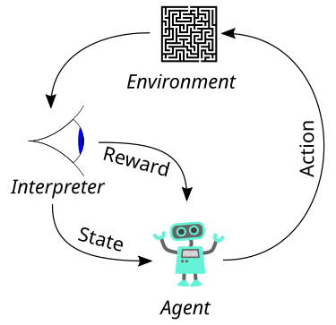
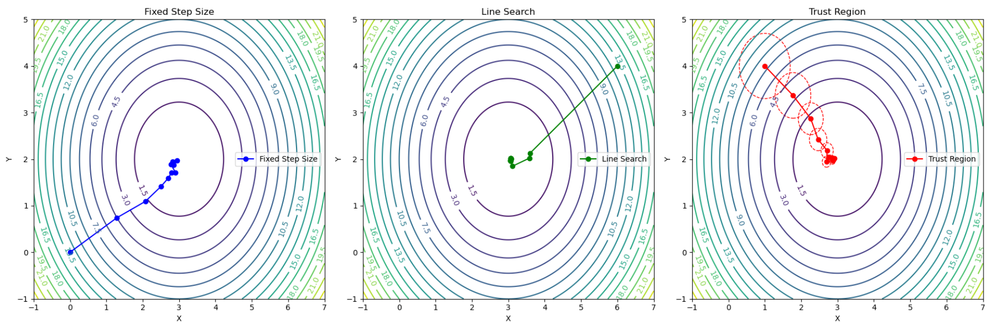
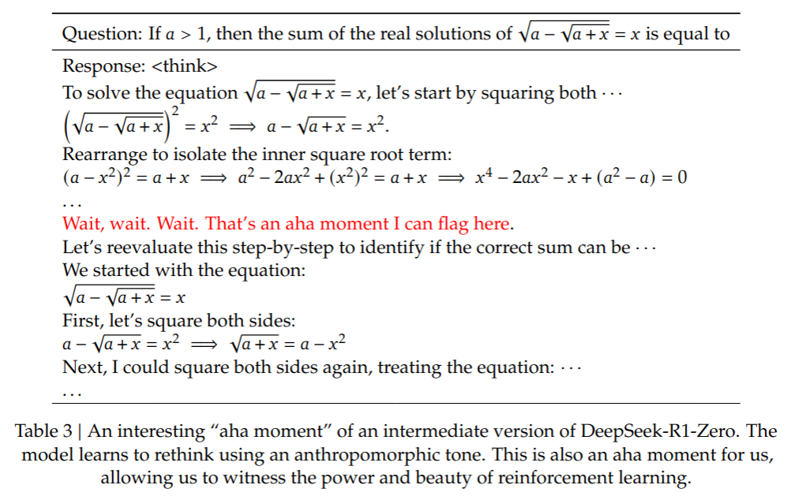

## 1. 什么是强化学习(RL, Reinforcement Learning)

传统的机器学习，包括深度学习，其本质是数学性的，严格遵守函数的数学定义：对于给定输入，产生确定的输出

$$F(x) = y$$

随着输入$x$和输出$y$的不同，这一范式可以适配各种不同的任务，比如：
* $x$ 是图像，$y$是类别，那么$F$就是Resnet这种图像模型；
* $x$ 是语音信号，$y$是文字，那么$F$就是一个语音识别模型；
* $x$ 是文本输入，$y$是文本输出，那么$F$就是时下火热的大语言模型；
...

强化学习（Reinforcement Learning）的本质上则是哲学性的，它探讨三个核心问题：
* 我是谁？一个Agent
* 我在哪？处于某个State
* 到哪里去？采取一个Action

如果站在上帝视角去观测这个Agent，我们还会发现：
* Agent处在一个环境中（Environment）
* Agent有一个用来策略（Policy）告诉我该采取什么动作（Action）
* 每执行一个动作（Action），环境都会给我反馈 (Reward)

以上就是强化学习中的主要概念。



## 2. 如何进行强化学习

这里以一个迷宫问题为例，介绍如何进行强化学习：

迷宫：(S: Start, E: End, W: Wall)

| S1(S) | S2 | S3(W) |
|-------|----|-------|
| S4    | S5 | S6    |
| S7(W) | S8 | S9(E) |

这个迷宫就是一个Environment。我们放置一个机器人在开始处（Start），让机器人自动学习如何走迷宫的策略（Policy）。这个策略可以记成$\pi(s)\rightarrow a, s \in [1-9], a \in [上, 下, 左, 右]$。开始时机器人对于迷宫一无所知，所以$\pi(s)会随机输出一个方向$。

### 2.1. Q-Learning

Q-Learning是最早，也是最简单的强化学习算法。前文提到的策略$\pi(s)$过于抽象了，所以我们也定义以下表格

|     | 上 | 下 | 左 | 右 |
|-----|----|----|----|----|
| s1  |    |    |    |    |
| s2  |    |    |    |    |
| ... |    |    |    |    |

我们称这张表为Q值表，表里边的元素 $Q(s, a)$表示在状态$s$下，采取动作$a$的奖励$reward$。基于这张Q值表，我们可以定义策略：
$$
\pi(s_i) \rightarrow \arg\max_a Q(s, a)|_{s=s_i}
$$
完成迷宫所需要的最小的Q值表如下：

|    | 上 | 下 | 左 | 右 |
|----|----|----|----|----|
| s1 | -1 | 1  | -1 | 0  |
| s4 | 0  | -1 | -1 | 1  |
| s5 | 0  | 1  | 0  | 0  |
| s8 | 0  | -1 | -1 | 1  |

可以指挥Agent沿如下路径行进

| S1(S)$\downarrow$ | S2              | S3(W) |
|-------------------|-----------------|-------|
| S4$\rightarrow$   | S5$\downarrow$  | S6    |
| S7(W)             | S8$\rightarrow$ | S9(E) |

但是我们很快发现Agent行进的路径并不唯一，比如以下路径也能让Agent走到终点

| S1(S)$\rightarrow$ | S2   $\downarrow$ | S3(W) |
|--------------------|-------------------|-------|
| S4                 | S5$\downarrow$    | S6    |
| S7(W)              | S8$\rightarrow$   | S9(E) |

这是强化学习的第一个问题，**模型的解不唯一**。稍后我们讨论这种解不唯一带来的问题。

### 2.2. Q-Learning 的学习过程

1. Q值表初始化，可以全部初始化为0；
2. 迭代学习：我们假设Agent被初始化在S0位置
	1. 选择action 
   

        $$a = \pi(s_i) = \arg\max_a Q(s, a)|_{s=s_i}$$

	2. 执行action, 环境Environment给出下一个状态$s'与奖励$r$

        $$s',r = Environment(s, a)$$

	3. 更新Q值，这里一般使用Bellman方程：

        $$Q(s,a)\leftarrow Q(s,a) + \alpha [r+\gamma \max_{a'}Q(s',a')-Q(s,a)]$$

    其中：

    - $\alpha$ 为学习率，控制Q值表的更新幅度；
    - $\gamma$ 为折扣因子，控制长期奖励与即时奖励的平衡；

Q-Learning本质上就是记住当前格子的奖励，同时不断根据未来价值重新评估当前格子的价值。最优情况下，总是选择未来价值最高的动作。在学习过程中，每个格子的Q值总是依赖于其他格子的Q值，格子之间相互依赖，非常容易导致Q值长期震荡无法收敛。此时需要对学习过程进行精细挑参才能保证学习过程的收敛性。这是强化学习的第二个问题。

#### 2.2.1. 利用和探索（exploitation & exploration）

如果单纯使用上述学习方法，很容易出现如下问题：

| S1(S)$\rightarrow$ | S2   $\downarrow$ | S3(W) |
|--------------------|-------------------|-------|
| S4                 | S5$\uparrow$      | S6    |
| S7(W)              | S8              | S9(E) |

即Agent在S2和S5之间反复震荡，无法真的走到终点S9。其原因在于Agent只能获取其历史路径上的Q值，缺乏对整个世界（Environment）的认知，无法发现S8和S6这种更加靠近终点的路径。我们称这种利用历史知识的过程为“利用”（exploitation）。

除了“利用”以外，我们还需要让Agent有一定的“探索”（exploration）能力，保持对世界的好奇心。最常见的探索方法是使用$\epsilon-greedy$改造策略 $\phi$:
$$
\phi(s_i) = 
\begin{cases} 
\pi(s_i) & \text{with probability } 1 - \epsilon \\
\text{random action} & \text{with probability } \epsilon 
\end{cases}
$$
即以概率$1-\epsilon$选择最优动作，以概率 $\epsilon$ 选择随机动作。为了让Q-Learning更好的收敛，可以在训练过程中逐步降低探索概率$\epsilon$。

#### 2.2.2. 强化学习的目标

强化学习的核心目标是找到一个最优策略$\pi^*$，使Agent在其生命周期内获得的期望奖励最大化：

$$J(\pi) = \mathbb{E}\left[ \sum_{t=0}^{\infty} \gamma^t R_t \mid \pi \right]$$

直接在策略空间优化$\pi$ 通常是不可行的：

* 策略空间过大：$\pi(a|s)$是一个概率分布，极大的增加了搜索难度；
* 无梯度信息：不经过特殊设计，难以直接对策略求导；

为了解决上述问题，引入了**值函数**来简化优化过程，值函数一般有两类：

* **状态价值函数$V^\pi(s)$**: 表示从某个状态$s$开始，遵循策略$\pi$后，所能获得的长期回报
$$
V^\pi(s) = \mathbb{E} \left[ \sum_{t=0}^{\infty} \gamma^t r_t \mid s_0 = s \right]
$$
* $\gamma$为折扣因子，控制未来奖励的重要性；
* $r_t$为时刻$t$的即时奖励；
* $\mathbb{{E}}_\pi$表示对策略$\pi$的所有可能多做求期望。

Bellman方程是上述值函数定义的递归形似，将上述定义拆解成了当前奖励和未来状态价值：
$$
V^\pi(s) = \sum_{a} \pi(a|s) [r(s, a)+\gamma V^\pi(s')]
$$

* **动作价值函数**$Q^\pi(s, a)$: 与状态价值函数类似，只是表示状态$s$下执行动作$a$后，能够得到的长期回报
$$
    Q^\pi(s,a) = \mathbb{E} \left[ \sum_{t=0}^{\infty} \gamma^t r_t \mid s_0 = s, a_0=a \right]
$$

#### 2.2.3. 强化学习的挑战

1. **训练样本的概率分布问题** 传统的监督学习中，一般要求训练样本和测试样本独立同分布，即样本独立抽样，但样本来源的概率分布保持不变。这样才能让监督学习算法从数据里边总结和学习规律。而强化学习通过与环境交互来获取样本，Agent的初始状态、运行轨迹都会影响采样过程。即不能保证两次训练之间的样本是独立同分布，也无法保证测试与训练的样本是独立同分布。

2. **部分观测与环境随机性** 强化学习训练过程只能对整个世界（Environment）进行部分观测，不能感知整个世界（没见过市面）。模型经常出现对局部过度学习、过拟合，对全局欠拟合。由于无法界定过拟合和欠拟合部分的边界，难以保证Agent在未见过的新环境中行为的合理性和稳定性。

3. **延迟反馈与稀疏奖励** 在许多强化学习问题中，奖励信号往往是延迟且稀疏的，导致Agent难以及时判定行为的好坏。这种激励信号的不连续性使得价值函数估计方差变大，会增加优化难度，必须采用奖励整形、经验回放等策略来缓解这一问题。

## 3. 策略梯度方法

在介绍策略梯度方法之前，我们先来看值函数方法的几个问题：

1. 只适合离散状态与动作空间
2. 需要额外组合探索策略
3. 随机探索对最坏情况缺乏控制；

而策略梯度方法是直接对策略进行求导的方法，首先需要将策略函数参数化:

$$
    \pi(a|s) \rightarrow \pi_\theta(a|s) 
$$

此时可以将强化学习的目标函数写为

$$
J(\theta) = \mathbb{E}_{\tau \sim p_\theta(\tau)}\left[ R(\tau) \right]
$$

这里：
* $\tau = (s_0, a_0, s_1, a_1, ..., s_T, a_T)$是一个轨迹；
* $R(\tau) = \sum_{t=0}^{T} r(s_t, a_t)$ 是轨迹的概率分布；
* $p_\theta(\tau)$ 是轨迹的概率，由策略概率和环境的转移概率组成；

### 3.1. 策略梯度定理

策略梯度可以根据策略梯度定理计算

$$
\nabla_\theta J(\theta) = \mathbb{E}_{\tau \sim p_\theta(\tau)}\left[\sum_{t=0}^{T} \nabla_\theta \log \pi_\theta(a_t|s_t)R(\tau)\right] \\
= \frac{1}{m} \sum_{i=1}^{m} \sum_{t=0}^{T} \nabla_\theta \log \pi_\theta(a_t|s_t)R(\tau)
$$

上式最后为minibatch上的梯度，对参数进行更新：

$$
\theta \leftarrow \theta + \alpha \nabla_\theta J(\theta) 
$$

策略梯度方法对比值函数方法，具备如下特点：

* 可以基于轨迹学习，而不需要实时交互和反馈
* 适合高维连续动作空间（包括embedding空间）
* 可以把序列生成模型可以作为策略：
    - 用户输入作为状态空间　Ｓ；
    - 模型输出作为动作空间　Ａ；
    - 模型参数作为策略参数　$\theta$; 

给出人类偏好反馈 $R(\tau)$即可直接使用PG方法训练LLM对齐人类偏好。但PG算法的梯度方差较大，稳定性欠佳。同时$R(\tau)$ 也难以直接定义、打分，因此PG方法并未实际应用于LLM对齐任务。

### 3.2. 策略梯度方法的改进--TRPO（Trust Region Policy Optimization）

对于策略的更新，如何选择步长$\alpha$是一个非常关键的问题：
   - 过大的步长会导致策略剧烈变化，破坏已学到的好的行为
   - 过小的步长会导致训练效率低下

常见的步长选择方法有三种：固定步长，线性搜索和信赖域，以下是三种方法的图示：

$$
\theta \leftarrow \theta + \alpha \nabla_\theta J(\theta) 
$$



固定步长方法是最为朴素的方法，但是步长会影响收敛性和稳定性，对实际问题搜索合理步长会比较麻烦；线性搜索会沿着梯度方向尝试多个步长，并选择最优步长，搜索开销较大，但效果最好；信赖域方法会根据梯度计算自适应信赖域，并保证在信赖域内更新。信赖域方法一方面能够保证每一步更新不会距离原策略太远，另一方面能够在梯度噪声过高时自动缩小信赖域，能够比较好的解决PG方法梯度噪声高问题。

上边讨论的步长搜索算法都在某种程度上要求目标函数具备凸性，而强化学习的目标显然不是图函数。为了解决目标函数凸性的问题，TRPO又引入了Minorize-Maximization 思想：对于一个难以优化，难以求导的目标函数，可以选择一个替代函数来描述目标函数的下届，通过迭代最小化这个下届替代函数可以完成对原目标函数的优化。

为了构造这个替代函数，我们引入一个优势函数的定义：

$$
A_\pi(s,a) = Q_\pi(s,a) - V_\pi(s)
$$

这个函数表示策略$\pi$采取动作$a$时的奖励比平均奖励高多少。TRPO最终求解的问题就变成
$$
\max_{\theta} E[\frac{\pi_\theta(a|s)}{\pi_{\theta_{old}}(a|s)} A_\theta(s,a)] \\
subject\ to \ E[D_{KL}(\pi_{\theta_{old}}(a|s) \pi_\theta(a|s))] \le \delta
$$

其中，$\frac{\pi_\theta(a|s)}{\pi_{\theta_{old}}(a|s)}$是重要性采样。

### 3.3. 策略梯度方法的改进--PPO(Proximal Policy Optimization)

近端优化（Proximal Optimization）是这样一种优化方法：通过引入一个近端约束项，让优化迭代过程中步长尽可能小，避免因权重剧烈变化而带来的训练不稳定。Proximal OPtimization在传统的凸优化领域有着广泛的应用。
$$
  \theta^* = \arg \max_\theta \left( 
    f(\theta) + \lambda \|\theta - \theta_t\|_p
  \right)
$$
其中$p \in \{1, 2\}$，常见使用$L_1$或者$L_2$作为约束项。

PPO通过clip操作限制策略的更新幅度

$$
J_{PPO}(\theta) = \mathbb{E} \left[ 
  \min(
    \frac{\pi_\theta(a|s)}{\pi_{\theta_{old}}(a|s)}A(s,a),
    clip(\frac{\pi_\theta(a|s)}{\pi_{\theta_{old}}(a|s)}, 1-\epsilon,1+\epsilon) A(s,a)
    )
\right]
$$
其中$clip()$函数会将$\frac{\pi_\theta(a|s)}{\pi_{\theta_{old}}(a|s)}$这个比值限制在$[1-\epsilon,1+\epsilon]$。

TRPO算法在计算信赖域时需要计算Fisher信息矩阵，并使用共轭梯度方法来更新，计算量较大。而PPO仅需要对重要性采样进行截断，更加的高效和稳定。

#### 优势函数的估计

在进行优势函数（Advantage Function）估计的时候，通常有两种方法：蒙特卡扩估计与时间差分估计：

1. 蒙特卡洛估计：通过完整回报近似$Q(s,a)$，需要完整的轨迹才能计算，一般用于离线数据

$$
A(s,a) = Q(s,a)-V(s) \approx \sum \gamma^tr_{t} - V(s)
$$

2. 时间差分估计：通过折扣未来奖励来近似$Q(s,a)$，可实时更新

$$
A(s,a) = Q(s,a) - V(s) \approx r_t+\gamma V(s_{t+1}) -V(s)
$$

蒙特卡洛估计可以给出无偏估计，但是优势函数的方差较大，而时间差分方差较小，但误差偏差较大。为了平衡两者PPO引入了GAE（Generalized Advantage Estimation）：

$$
A_t^{GAE(\gamma, \lambda)} = \sum_{l=0}^{T-t}(\gamma \lambda)^l\delta_t +l
$$

其中$\delta_t$是$t$时刻的TD残差

$$
\delta_t = r_{t+1} + \gamma V(s_{t+1}) - V(s_t)
$$

参数$\lambda$用来控制蒙特卡洛估计与时间差分估计之前的权衡：
1. $\lambda$ 越大越趋向于未来奖励，更倾向于蒙特卡罗方法，提供高方差低偏差的估计；
2. $\lambda$ 越小越趋向于即时奖励，更加倾向于时间差分方法，提供低方差但高偏差的估计；

#### RLHF with PPO

RLHF巧妙的在PPO框架下引入了人类反馈（Human Feedback），整个框架共涉及4个模型：

- **Actor Model：** 演员模型，就是需要对齐的LLM模型，用于提供策略$\pi(a|s)$；
- **Critic Model：** 评论家模型，用于估计总收益 $V_t$；
- **Reward Model：** 奖励模型，用于估计计算即时收益 $R_t$；
- **Reference Model：** 参考模型，用于提供训练阶段的约束，防止模型训歪（用于计算KL散度）；

训练时，RM模型需要独立训练，而Actor Model与Critic Model则是在PPO的过程中一起训练。如果两者共享参数，但是使用不同的head，我们也称Actor Model为策略网络，Critic Model为值网络。

RLHF的过程相当繁琐，并且训练过程也并不非常稳定，因此LLaMa系列模型在开始的时候仅使用了SFT，但是在LLaMa2时又重新引入了RL进行偏好对齐，提升用户体验。

### 3.4. 策略梯度方法的改进--GRPO（Group Relative Policy Optimization）

PPO算法中的值函数只对最后一个token评估，复杂并且引入额外的不确定性。GRPO能够避免值函数估计，使得整个训练过程更加简单，具体来说：

$$
J_{GRPO}(\theta) = \frac{1}{G} \sum_{i=1}^G\frac{1}{|o_i|} \sum_{t=1}^{o_i} \{ 
\min \left [ 
\frac{\pi_\theta}{\pi_{\theta_{old}}} \hat{A}_{i,t} 
clip\left( 
  \frac{\pi_\theta}{\pi_{\theta_{old}}}, 
  1-\epsilon, 
  1+\epsilon \right) \hat{A}_{i,t}
\right ]
-\beta \mathbb{D}_{KL}[\pi_\theta \| \pi_{\theta_{old}}]
\}
$$

对于每个问题$q$，生成$G$个回答$o_i, i\in[1..G]$，每个答案的长度为$|o_i|$。

GRPO引入了一种全新的优势函数定义：

$$
\hat{A}_{i,t} = \frac{r_i - mean(r)}{std(r)}
$$

即第$i$个输出的奖励$r_i$，相对整个Group的优势，该式与Batch Normal极为类似。计算这个优势函数只需要计算每个输出的奖励即可，无需再估计值函数。

## DeepSeek R1

奖励是GRPO整个训练的信号来源，DeepSeek R1在训练中主要使用基于规则的奖励。一方面基于规则的奖励能够节约训练资源，另一方面也能避免Reward Hacking问题。

!!! 什么是Reward Hacking
    
    Reward Hacking是指强化学习训练时，Agent通过不符合预期的方式，利用奖励函数的漏洞来最大化其奖励，从而破解训练过程。产生Reward Hacking的主要原因在于奖励函数本身不完美，特别是一些基于规则设计的复杂奖励函数，在不限定可行域的时候，经常会导致Agent尝试逃逸到非可行域，从而获得超额奖励。

#### DeepSeek R1-Zero

DeepSeek R1-Zero是纯粹基于强化学习训练的模型，主要采用了两种规则奖励：

- Accuracy Rewards：主要同归规则，比如文本匹配和正则表达式来给出奖励，针对LeetCode甚至会使用compiler作为奖励反馈的来源；

- Format Rewards：奖励模型将思考过程放入`<think>...</think>`标签中；

在训练的过程中，使用了如下的模板：

```
A conversation between User and Assistant. The user asks a question, and the Assistant solves it.
The assistant first thinks about the reasoning process in the mind and then provides the user
with the answer. The reasoning process and answer are enclosed within <think> </think> and
<answer> </answer> tags, respectively, i.e., <think> reasoning process here </think>
<answer> answer here </answer>. User: prompt. Assistant:
```

在R1-Zero的训练过程中，可以看到模型在Reasoning Task上持续稳定则性能改善。并且观测到了Aha-Moment。

!!! Aha Moment
    Aha Moment是指某个人突然理解或者领悟某个概念、问题或者想法的瞬间，中文可以称作“顿悟”时刻，使得对某个问题的解决有一个飞跃。



虽然R1-Zero表现出了很轻的Reasoning能力，但其输出的可读性较差，并且会中英文。为了让模型的体现更好，又开发了R1，加入human-friendly的冷启动数据。

#### DeepSeek R1

##### Cold Start

使用数千条长CoT数据对模型进行微调：
  - 数据可读性：主要解决多语言混合问题与Markdown格式缺失问题；
  - 潜力：基于人工先验设计数据；

##### Reasoning RL

使用RL提升模型的Reasoning能力，为了避免多语言混合，引入了惩罚项。

##### 拒绝采样与SFT

主要为了提升Reasoning以外的能力，比如写作和对话，通过SFT来实现。数据主要包含：
- Reasoning数据：使用生成式Reward函数，将ground truth和模型输出同时输入给base模型进行判断；以此种方式收集60W训练数据；
- Non-Reasong数据：使用prompt让模型为writing、QA等任务添加CoT，并收集20W输出作为训练数据；

##### RL for all scenarios

再次通过RL提升模型的helpness和harmlessness。
