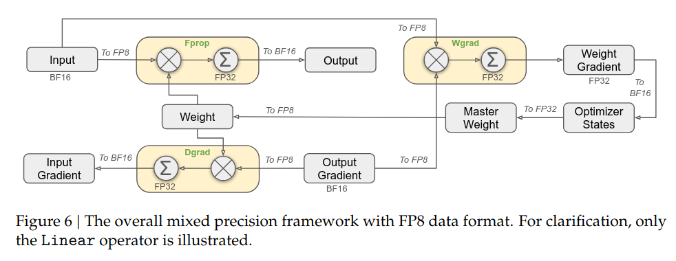
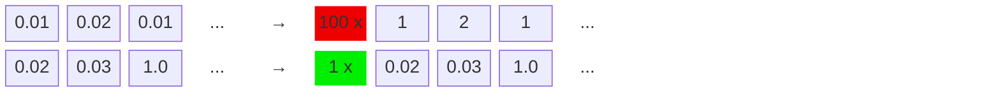
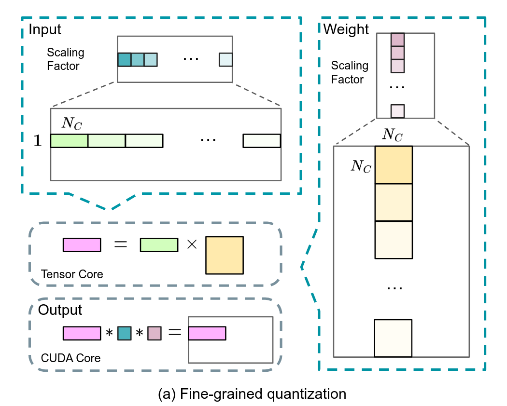

## IEEE 754 标准与浮点数

IEEE 754 是目前广为使用的浮点数规范，定义了浮点数的 bitwise 表达与量化方式。浮点数的二进制表达分为三部分：

- 符号位（sign）
- 指数位（exponent）
- 尾数位（mantissa）

```mermaid
block-beta
    columns 33
    FP32["fp32"]
    S1["S"]
    E1["E"]
    E2["E"]
    E3["E"]
    E4["E"]
    E5["E"]
    E6["E"]
    E7["E"]
    E8["E"]
    M1["M"]
    M2["M"]
    M3["M"]
    M4["M"]
    M5["M"]
    M6["M"]
    M7["M"]
    M8["M"]
    M9["M"]
    M10["M"]
    M11["M"]
    M12["M"]
    M13["M"]
    M14["M"]
    M15["M"]
    M16["M"]
    M17["M"]
    M18["M"]
    M19["M"]
    M20["M"]
    M21["M"]
    M22["M"]
    M23["M"]

    BF16["bf16"]
    SS1["S"]
    EE1["E"]
    EE2["E"]
    EE3["E"]
    EE4["E"]
    EE5["E"]
    EE6["E"]
    EE7["E"]
    EE8["E"]
    MM1["M"]
    MM2["M"]
    MM3["M"]
    MM4["M"]
    MM5["M"]
    MM6["M"]
    MM7["M"]
    space:16

    FP16["fp16"]
    space:3
    ss1["S"]
    ee1["E"]
    ee2["E"]
    ee3["E"]
    ee4["E"]
    ee5["E"]
    mm1["M"]
    mm2["M"]
    mm3["M"]
    mm4["M"]
    mm5["M"]
    mm6["M"]
    mm7["M"]
    mm8["M"]
    mm9["M"]
    mm10["M"]
    space:13

    E5M2["fp8"]
    space:3
    s1["S"]
    e1["E"]
    e2["E"]
    e3["E"]
    e4["E"]
    e5["E"]
    m1["M"]
    m2["M"]
    space:21

    E4M3["fp8"]
    space:4
    sss1["S"]
    eee1["E"]
    eee2["E"]
    eee3["E"]
    eee4["E"]
    mmm1["M"]
    mmm2["M"]
    mmm3["M"]
    space:21

    classDef name fill:#00000000, stroke:#00000000
    class FP32,BF16,FP16,E4M3,E5M2 name

    classDef sign fill:#EE0000, stroke:#00000000
    class S1,SS1,s1,ss1,sss1 sign

    classDef exp fill:#00EE00, stroke:#00000000
    class E1,E2,E3,E4,E5,E6,E7,E8 exp
    class EE1,EE2,EE3,EE4,EE5,EE6,EE7,EE8 exp
    class e1,e2,e3,e4,e5,e6,e7,e8 exp
    class ee1,ee2,ee3,ee4,ee5,ee6,ee7,ee8 exp
    class eee1,eee2,eee3,eee4,eee5,eee6,eee7,eee8 exp
```

### FP8 的两种格式

当从 16 位进一步降低浮点数位数时，会面临动态范围不足的问题，因此 Nvidia、Arm 和 Intel 在其提出的 FP8 规范中设计了两种浮点数类型[^fp8]：E4M3 和 E5M2

|               | E4M3                                 | E5M2                                     |
| ------------- | ------------------------------------ | ---------------------------------------- |
| format(s/e/m) | 1/4/3                                | 1/5/2                                    |
| Exponent bias | 7                                    | 15                                       |
| Infinities    | N/A                                  | S.11111.00                               |
| NaN           | S.1111.111                           | S.11111.{01,10,11}                       |
| Zeros         | S.0000.000                           | S.00000.00                               |
| Max normal    | S.1111.110 = $1.75 \times 2^8$ = 448 | S.11111.11 = $1.75 \times 2^15$ = 57.344 |
| Min normal    | S.0001.0000 = $2^{-6}$               | S.00001.00 = $2^{-14}$                   |
| Max subnorm   | S.0000.111 = $0.875 \times 2^{-6}$   | S.00000.11 = $0.75\times 2^{-14}$        |
| Min subnorm   | S.0000.001 = $2^{-9}$                | S.00000.01 = $ 2^{-16}$                  |

若严格遵循 IEEE 754 规范，E4M3 会浪费 8 个二进制表达在 Inf 与 NaN 上。因此在定义 E4M3 规范是对这些二进制表达进行了额外开发。

### FP8 在 Nvidia 的支持情况

H100 提供 3 倍 A100 FP16 性能，若启用 FP8 算力能够再次翻倍。根据 Nvidia 官方的介绍：

1. Nvidia 通过 Transformer Engine 提供自动 FP8 转换，用户可无缝切换到 FP8；
2. 已经使用 BF18 训练的人物，可以使用 FP8 继续训练；
3. 通过引入 delayed scaling 策略，自动对 FP8 的 tensor 进行缩放；

但世纪使用时，TransformerEngine的FP8方案在精度上仍会有所DIFF。在实际LLM训练中，各大公司和组织仍然优先选择BF16。

## Transformer Engine 的 FP8 方案

Transformer Engine 是 Nvidia 为 FP8 训练开发的 Transformer 加速库，提供从`Linear`、`Attention`到`LayerNorn`等基础组件的 FP8 实现。下图是支持 FP8 的一个说明图示：

[^fp8]: [FP8 FORMATS FOR DEEP LEARNING](https://arxiv.org/pdf/2209.05433)

权重和梯度均使用高精度存储，仅矩阵乘使用 FP8 进行运算，来提升算力。在矩阵乘之前通过 cast 操作将高精度的权重和激活转换为 FP8。矩阵乘的输出仍为高精度，不影响 bias 操作与激活操作。

TransformerEngine 在 BF16 精度下，能够降低显存使用，若启用 FP8 训练，能够提速 30%，但无法带来额外的显存节约，反而会因为 checkpoint 中存储额外的 scaling 值，导致更多 5%的显存占用。

_TE 的 FP8 方案评价_: FP 有三部分理论收益：

1. 计算性能翻倍；
2. 显存开销减半；
3. 通信吞吐减半；

TE 所使用的 FP8 方案实际上只拿到了 30%的计算性能收益，仍有巨大的优化改进空间。

## DeepSeek V3 的 FP8 方案

与 TransformerEngine 的主要不同：

1. weight 使用 FP8 存储；
2. 全部使用 E4M3 浮点格式；
3. 使用 block-wise scaling，而不是 pre-tensor scaling；

master weight、权重梯度使用 FP32,激活梯度、优化器状态使用 BF16。这些高精度数据会被切分到不同的 DP rank 上，因此对整体显存开销影响可以控制得比较好。

### 降低显存开销与通信开销

- **低精度优化器状态：** AdamW 优化器的一阶动量与二阶动量使用 BF16 存储来降低显存压力，但是 master weight 与 main grad 仍然使用 FP32 存储;
- **低精度激活值：** 针对不同的激活值使用了不同的精度
  - Attention 之后的 Linear 层，由于 attention 的梯度计算对精度敏感，这些激活使用了 E5M6 数据类型。并且为了避免引入额外的量化误差，会使用幂次缩放因子；
  - **MoE 中 SwiGLU 的输入：** 引入 recompute 策略，使用 FP8 格式缓存输入；
- 低精度通信：MoE 的通信是训练过程中最主要的瓶颈之一。为了降低这部分开销，将 MoE 前向 up-projection 操作与反向的 down-projection 操作前的激活/激活梯度进行 FP8 量化，之后再进行 dispatch 逻辑，量化过程使用幂次缩放因子。对于 combine 模块，使用 BF16 来保证训练精度。

### 细粒度量化方法

FP8两种数据类型，E5M2保留动态范围但是缩减了尾数精度，E4M3多保留了一位尾数精度但是牺牲了动态范围。不管那一种都会加剧训练过程中的上溢和下溢问题。好在LLM模型训练时，权重与激活的动态性研究发现大多数数值分布集中在0附近，但会带有明显的少数outlier。集中在0附近意味着我们可以通过缩放因子（scaling factor）对数值进行缩放，从而更好的利用有限的动态范围。但outlier的存在导致很难在整个tensor层面选取出适当的缩放因子。

为了平衡数值的整体分布与少数outlier的分布，可以引入分块量化策略：将数据分成1x128或者128x128的block，并对每个block选取一个缩放因子。对于大多数block可以选择较大的缩放因子来更好的利用动态范围，而对于存在outlier的block可以使用较小的缩放因子来避免出现上溢。

使用块粒度量化后的矩阵乘运算如下图所示：

- **高精度Accumulation：** Nvidia H800 GPU的Tensor Core在执行FP8矩阵计算时，累积精度被限制在大约14位，远小于FP32精度。当LLM训练的权重矩阵规模与输入规模变大时，这个问题会越来越显著。DeepSeek团队的测试中，大小为4096的矩阵乘运算因为累积精度问题出现了最大2%的相对误差。为了解决这个问题，引入了分级累加：使用Tensor Core默认的累加精度进行计算，当累积一定次数后，再将这个部分累加结果搬运到CUDA Core上进行FP32累加。

- **E4M3与在线量化：** 引入细粒度量化后，不再需要同时维护E4M3和E5M2两种精度，因此DeepSeek团队只使用E4M3数据格式。同时，为了维护好分块量化的缩放因子，并简化框架，使用算子内部的在线量化代替TransformerEngine中的延迟量化。

DeepSeek团队在FP8精度上对算子和框架作了大幅度的优化，这些优化需要对模型框架、训练过程的动态性以及硬件的实现细节都有充分的了解。整体方案在计算、显存和通信上都有不小的收益：

- 计算：DeepSeek方案与TransformerEngine方案都能加速Linear相关的三次矩阵计算（前向，权重反向和激活反向），因此能够拿到的收益应该与TransformerEngine的30%类似。少了一次权重的cast，但是多出了块量化与高精度累加操作；
- 存储：使用16位优化器状态，这部分显存开销降低一半。Attention后的激活使用12 bit存储，对比BF16降低25%。SwiGLU部分激活通过recompute降低4倍，通过FP8再降低一半；
- 通信：使用FP8将通信数据量降低一倍；

## FP8的一些精度分析

### 影响精度的因素有哪些

### 为何累加使用高精度？？

因为累加和的动态范围比较大，在数值比较大的时候，量化误差也会比较大，更容易损失精度。

### Cast 操作的实现
