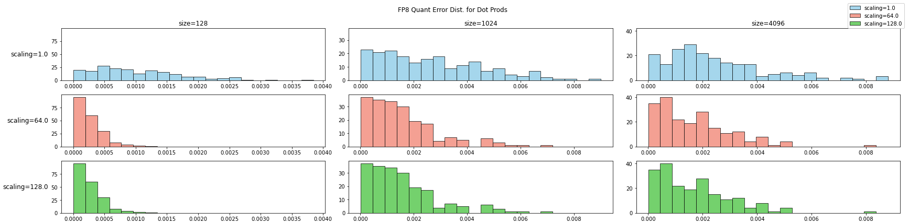
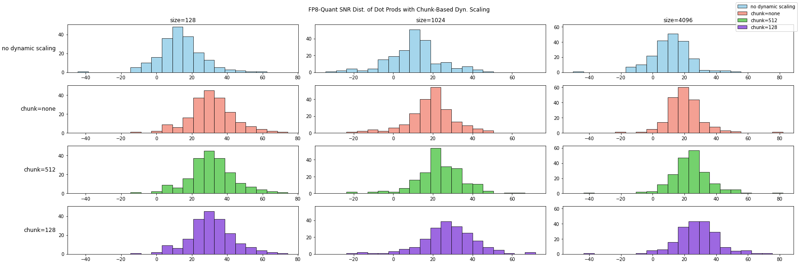

## IEEE 754 标准与浮点数

IEEE 754 是目前广为使用的浮点数规范，定义了浮点数的 bitwise 表达与量化方式。浮点数的二进制表达分为三部分：

- 符号位（sign）
- 指数位（exponent）
- 尾数位（mantissa）

### FP8 的两种格式

当从 16 位进一步降低浮点数位数时，会面临动态范围不足的问题，因此 Nvidia、Arm 和 Intel 在其提出的 FP8 规范中设计了两种浮点数类型[^fp8]：E4M3 和 E5M2

|               | E4M3                                 | E5M2                                     |
| ------------- | ------------------------------------ | ---------------------------------------- |
| format(s/e/m) | 1/4/3                                | 1/5/2                                    |
| Exponent bias | 7                                    | 15                                       |
| Infinities    | N/A                                  | S.11111.00                               |
| NaN           | S.1111.111                           | S.11111.{01,10,11}                       |
| Zeros         | S.0000.000                           | S.00000.00                               |
| Max normal    | S.1111.110 = $1.75 \times 2^8$ = 448 | S.11111.11 = $1.75 \times 2^15$ = 57.344 |
| Min normal    | S.0001.0000 = $2^{-6}$               | S.00001.00 = $2^{-14}$                   |
| Max subnorm   | S.0000.111 = $0.875 \times 2^{-6}$   | S.00000.11 = $0.75\times 2^{-14}$        |
| Min subnorm   | S.0000.001 = $2^{-9}$                | S.00000.01 = $ 2^{-16}$                  |

若严格遵循 IEEE 754 规范，E4M3 会浪费 8 个二进制表达在 Inf 与 NaN 上。因此在定义 E4M3 规范是对这些二进制表达进行了额外开发。

### FP8 在 Nvidia 的支持情况

H100 提供 3 倍 A100 FP16 性能，若启用 FP8 算力能够再次翻倍。根据 Nvidia 官方的介绍：

1. Nvidia 通过 Transformer Engine 提供自动 FP8 转换，用户可无缝切换到 FP8；
2. 已经使用 BF18 训练的人物，可以使用 FP8 继续训练；
3. 通过引入 delayed scaling 策略，自动对 FP8 的 tensor 进行缩放；

但在实际使用中，TransformerEngine 的 FP8 方案在精度上仍会有所 DIFF。在实际 LLM 训练中，各大公司和组织仍然优先选择 BF16。

## Transformer Engine 的 FP8 方案

Transformer Engine 是 Nvidia 为 FP8 训练开发的 Transformer 加速库，提供从`Linear`、`Attention`到`LayerNorn`等基础组件的 FP8 实现。下图是支持 FP8 的一个说明图示：

[^fp8]: [FP8 FORMATS FOR DEEP LEARNING](https://arxiv.org/pdf/2209.05433)

权重和梯度均使用高精度存储，仅矩阵乘使用 FP8 进行运算，来提升算力。在矩阵乘之前通过 cast 操作将高精度的权重和激活转换为 FP8。矩阵乘的输出仍为高精度，不影响 bias 操作与激活操作。

TransformerEngine 在 BF16 精度下，能够降低显存使用，若启用 FP8 训练，能够提速 30%，但无法带来额外的显存节约，反而会因为 checkpoint 中存储额外的 scaling 值，导致更多 5%的显存占用。

_TE 的 FP8 方案评价_: FP 有三部分理论收益：

1. 计算性能翻倍；
2. 显存开销减半；
3. 通信吞吐减半；

TE 所使用的 FP8 方案实际上只拿到了 30%的计算性能收益，仍有巨大的优化改进空间。

## DeepSeek V3 的 FP8 方案

与 TransformerEngine 的主要不同：

1. weight 使用 FP8 存储；
2. 全部使用 E4M3 浮点格式；
3. 使用 block-wise scaling，而不是 pre-tensor scaling；

master weight、权重梯度使用 FP32,激活梯度、优化器状态使用 BF16。这些高精度数据会被切分到不同的 DP rank 上，因此对整体显存开销影响可以控制得比较好。

### 降低显存开销与通信开销

- **低精度优化器状态：** AdamW 优化器的一阶动量与二阶动量使用 BF16 存储来降低显存压力，但是 master weight 与 main grad 仍然使用 FP32 存储;
- **低精度激活值：** 针对不同的激活值使用了不同的精度
  - Attention 之后的 Linear 层，由于 attention 的梯度计算对精度敏感，这些激活使用了 E5M6 数据类型。并且为了避免引入额外的量化误差，会使用幂次缩放因子；
  - **MoE 中 SwiGLU 的输入：** 引入 recompute 策略，使用 FP8 格式缓存输入；
- 低精度通信：MoE 的通信是训练过程中最主要的瓶颈之一。为了降低这部分开销，将 MoE 前向 up-projection 操作与反向的 down-projection 操作前的激活/激活梯度进行 FP8 量化，之后再进行 dispatch 逻辑，量化过程使用幂次缩放因子。对于 combine 模块，使用 BF16 来保证训练精度。

### 细粒度量化方法

FP8 两种数据类型，E5M2 保留动态范围但是缩减了尾数精度，E4M3 多保留了一位尾数精度但是牺牲了动态范围。不管那一种都会加剧训练过程中的上溢和下溢问题。好在 LLM 模型训练时，权重与激活的动态性研究发现大多数数值分布集中在 0 附近，但会带有明显的少数 outlier。集中在 0 附近意味着我们可以通过缩放因子（scaling factor）对数值进行缩放，从而更好的利用有限的动态范围。但 outlier 的存在导致很难在整个 tensor 层面选取出适当的缩放因子。

为了平衡数值的整体分布与少数 outlier 的分布，可以引入分块量化策略：将数据分成 1x128 或者 128x128 的 block，并对每个 block 选取一个缩放因子。对于大多数 block 可以选择较大的缩放因子来更好的利用动态范围，而对于存在 outlier 的 block 可以使用较小的缩放因子来避免出现上溢。

使用块粒度量化后的矩阵乘运算如下图所示：

- **高精度 Accumulation：** Nvidia H800 GPU 的 Tensor Core 在执行 FP8 矩阵计算时，累积精度被限制在大约 14 位，远小于 FP32 精度。当 LLM 训练的权重矩阵规模与输入规模变大时，这个问题会越来越显著。DeepSeek 团队的测试中，大小为 4096 的矩阵乘运算因为累积精度问题出现了最大 2%的相对误差。为了解决这个问题，引入了分级累加：使用 Tensor Core 默认的累加精度进行计算，当累积一定次数后，再将这个部分累加结果搬运到 CUDA Core 上进行 FP32 累加。

- **E4M3 与在线量化：** 引入细粒度量化后，不再需要同时维护 E4M3 和 E5M2 两种精度，因此 DeepSeek 团队只使用 E4M3 数据格式。同时，为了维护好分块量化的缩放因子，并简化框架，使用算子内部的在线量化代替 TransformerEngine 中的延迟量化。

DeepSeek 团队在 FP8 精度上对算子和框架作了大幅度的优化，这些优化需要对模型框架、训练过程的动态性以及硬件的实现细节都有充分的了解。整体方案在计算、显存和通信上都有不小的收益：

- 计算：DeepSeek 方案与 TransformerEngine 方案都能加速 Linear 相关的三次矩阵计算（前向，权重反向和激活反向），因此能够拿到的收益应该与 TransformerEngine 的 30%类似。少了一次权重的 cast，但是多出了块量化与高精度累加操作；
- 存储：使用 16 位优化器状态，这部分显存开销降低一半。Attention 后的激活使用 12 bit 存储，对比 BF16 降低 25%。SwiGLU 部分激活通过 recompute 降低 4 倍，通过 FP8 再降低一半；
- 通信：使用 FP8 将通信数据量降低一倍；

## FP8 的一些精度分析

### 影响精度的因素

DeepSeek 团队已经分析了影响精度的主要原因之一——矩阵规模。此处我们更加系统性的讨论影响精度的因素有哪些：

1. Attention 计算 Score 包含了 Q 和 K 的内积计算；

$$
score = Softmax\left( \frac{QK^T}{\sqrt{d_k}} \right)
=Softmax\left( \frac{
   \begin{bmatrix}
   Q_0 \cdot K_0^T & Q_0 \cdot K_1^T & \dots \\
   Q_1 \cdot K_0^T & Q_1 \cdot K_1^T & \dots \\
   \vdots & \vdots & \ddots \\
   \end{bmatrix}
}{\sqrt{d_k}} \right)
$$

2. Attention 计算根据 Score 的加权 V，本质是 score 向量与 V 不同 channel 构成的向量的内积计算；

$$
Output = score \cdot V = score \cdot
\begin{bmatrix}
    c_0 \\
    c_1 \\
    \vdots
\end{bmatrix}
= \begin{bmatrix}
    score \cdot c_0 \\
    score \cdot c_0 \\
    \vdots
\end{bmatrix}
$$

3. 矩阵计算可以拆解成很多向量内积计算：
   $$
   A \times B =
   \begin{bmatrix}
   a_0 \\
   a_1 \\
   \vdots
   \end{bmatrix}
   \times
   \begin{bmatrix}
   b_0 ;
   b_1;
   \dots
   \end{bmatrix} =
   \begin{bmatrix}
   a_0 b_0 & a_0 b_1 & \dots \\
   a_1 b_0 & a_1 b_1 & \dots \\
   \vdots & \vdots & \ddots \\
   \end{bmatrix}
   $$

因此，研究向量内积的数值精度对于 LLM 训练来讲尤为重要。影响精度的主要因素有三方面：

1. 矩阵规模的影响
2. 向量相关性的影响

### 矩阵规模的影响

先通过一个简单的实验观察下向量长度（矩阵规模）对误差的影响，我们使用$x\sim \mathcal{N}(0,0.01)$初始化向量，并转换成 FP8 E4M3 来进行内积计算，并引入一个 scaling factor 在计算过程中对向量进行缩放（类似 TransformerEngine 中的 tensor-wise scaling）：

直观来看，矩阵规模越大误差越大，而引入 tensor scaling factor 后确实能够降低噪声。这里我们引入信噪比来更好地衡量误差，来分析如何改善矩阵规模较大情况下的信噪比：

$$ SNR = 10 \times \log\_{10} \frac{\sum{signal_i^2} }{\sum{nosie_i^2}}$$

##### Tensor-wise Scaling

tensor scaling 是指在进行数据 cast 和计算时，通过一个 scaling factor 对数值进行缩放，以便充分利用每一个 bit。这里进行了三组实验，scaling factor 分别为 1.0、64 和 128：

可以看到，虽然量化误差的绝对值在增长，但信噪比在不同尺度下基本保持稳定。并且随着引入 scaling factor，能够极大的改进在各个规模下的信噪比。

##### 分块累加

分块累加是指对于向量计算中的累加操作，分成小 chunk 来进行。chunk 内使用 FP8累加，chunk 间使用高精度浮点数来累加：

分 chunk 累加在小规模情况下并为提供太多信噪比优势，但是对于较大规模的矩阵，可以显著改善最坏情况，提供接近 20 dB 的提升

!!! note "为何累加使用高精度？"

    因为累加和的动态范围比较大，在数值比较大的时候，量化误差也会比较大，更容易损失精度。

##### Block-wise Scaling

分块scaling是指对向量进行分块，并对每一个分块单独计算最有的缩放因子。相比Tensor-wise Scaling，分块Scaling能够进一步帮我我们充分利用bit位。

对比Fix Scaling和Tensor-wise Scaling，分块Scaling大幅度改善了最坏情况，基本能够避免信噪比小于零的情况（即信号被噪声淹没的情况）。

### Cast 操作的实现
