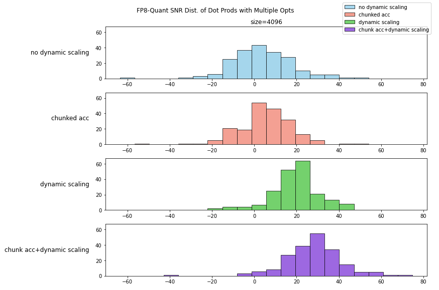
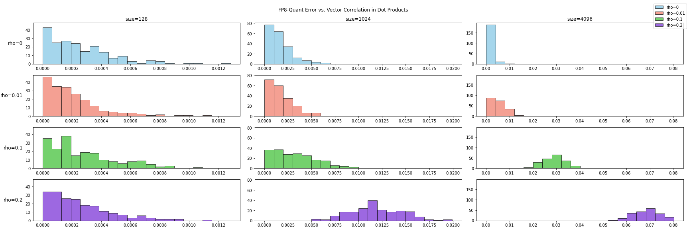
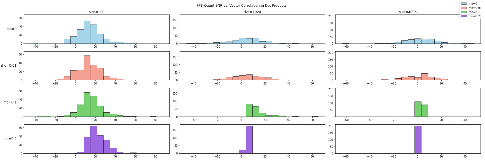
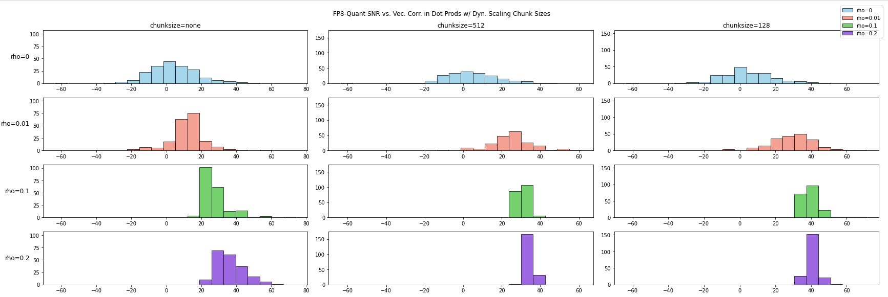

DeepSeek V3 的发布引起了对 FP8 训练的广泛关注，业界也出现了大量文章解析 How 的问题——DeepSeek 是怎么进行 FP8 训练的，与传统方案有哪些不同。但是目前鲜有文章对 Why 问题进行深入探讨，为何 DeepSeek 的方案能够取得成功。本文尝试对 FP8 训练所面临的挑战进行深入解析，并尝试猜测 DeepSeek 团队设计其 FP 方案的背后原理。（如果你对 INT8 训练感兴趣，可以参考本文的姊妹篇：[INT8 训练](//2025/02/15/int8_training/)）

## 1. FP8 浮点格式

### 1.1 FP8 格式的历史

FP8 是一种遵循 IEEE 754 规范[^ieee754]的 8 位浮点数格式，由 Nvidia 在 2022 年发布的 H100 GPU 中首次引入。在此之前，Nvidia 硬件上浮点数格式的发展历程如下[^huang_law_1]：

- 2016 年 P100 GPU 首次引入 FP16 数据格式，直接开启了深度学习混合精度训练的技术路线；
- 2017 年 V100 GPU 首次引入 Tensor Core, 用于加速 FP16 矩阵乘法运算；
- 2020 年 A100 GPU 首次引入 TF32 数据格式，可通过 Tensor Core 加速；引入 bfloat16 数据格式，提供比 FP16 更宽的动态范围（当下 BF16 已经成为 LLM 训练的主流方案）；
- 2022 年 H100 GPU 首次引入 FP8 数据格式；

FP8 被 Nvidia 给予厚望，认为其成功的延续了 CEO 提出的 Huang's Law[^huang_law_2]，即 10 年间 GPU 硬件算力提升 1000 倍。在过去的 10 年间，新型数值表达的引入了 16 倍算力提升，是诸多技术中贡献最大者，GPU 架构与复杂指令集紧随其后带来了 12.5 倍提升，而制程进步带来的收益非常有限，仅 2.5 倍[^nvidia_gpu]。

### 1.2. 常见浮点数与 IEEE 754

IEEE 754 是目前广为使用的浮点数规范，定义了浮点数的 bitwise 表达与量化方式。浮点数的二进制表达分为三部分：

- 符号位（sign）
- 指数位（exponent）
- 尾数位（mantissa）

常见的浮点数格式的二进制表达如下图所示：

### 1.3. FP8 有两种格式

随着浮点数位数从 16 位进一步降低到 8 位，动态范围不足的问题逐渐显现。因此 Nvidia、Arm 和 Intel 在 FP8 规范中设计了两种浮点数类型[^fp8]：E4M3 和 E5M2

|               | E4M3                                 | E5M2                                     |
| ------------- | ------------------------------------ | ---------------------------------------- |
| format(s/e/m) | 1:4:3                                | 1:5:2                                    |
| Exponent bias | 7                                    | 15                                       |
| Infinities    | N/A                                  | S.11111.00                               |
| NaN           | S.1111.111                           | S.11111.{01,10,11}                       |
| Zeros         | S.0000.000                           | S.00000.00                               |
| Max normal    | S.1111.110 = $1.75 \times 2^8$ = 448 | S.11110.11 = $1.75 \times 2^15$ = 57.344 |
| Min normal    | S.0001.0000 = $2^{-6}$               | S.00001.00 = $2^{-14}$                   |
| Max subnorm   | S.0000.111 = $0.875 \times 2^{-6}$   | S.00000.11 = $0.75\times 2^{-14}$        |
| Min subnorm   | S.0000.001 = $2^{-9}$                | S.00000.01 = $ 2^{-16}$                  |

浮点数都会分配一些二进制表达来表示特殊值**NaN**和 **$\mathbb{\pm}$Inf**，IEEE 754 规范约定使用指数位全**1**的二进制表达来表示这些特殊值。对于 E4M3 格式来说，若严格遵循 IEEE 754 规范，会 8 个二进制表达。因此在定义 E4M3 规范时对这些二进制表达进行了额外开发，仅在指数位尾数位同时全为 **1** 时才表示 **NaN**，全为 **0** 的时候表示 **$\pm$Inf**。

H100 的 Tensor Core 提供 3 倍 A100 FP16 性能，若启用 FP8 算力能够再次翻倍。

<!-- more -->

## 2. Transformer Engine 的 FP8 方案

Transformer Engine 是 Nvidia 为 FP8 训练开发加速库，提供了从`Linear`、`Attention`到`LayerNorm`等基础组件的 FP8 实现。下图展示了 TransformerEngine 支持 FP8 矩阵乘法的方案：

权重和梯度均使用高精度存储，FP8 仅用来进行矩阵乘运算。在矩阵乘之前需要通过 cast 操作将高精度的权重和激活转换为 FP8 格式。矩阵乘的输出仍为高精度，不影响 bias 操作与激活操作。在前向计算中使用 E4M3 进行运算，在反向过程中使用 E5M2 进行计算。

TransformerEngine 通过融合算子来降低模型训练时的显存开销。对比 BF16 训练，FP8 训练能够带来 30% 端到端性能提升，但因为权重和激活仍然使用高精度存储，无法带来额外的显存节约，反而会因为 checkpoint 中存储额外的 scaling 值，导致 5%的额外显存占用。

综合评价一下 TransformerEngine 的 FP8 方案，FP8 训练有三部分理论收益：

1. 计算性能翻倍；
2. 显存开销减半；
3. 通信吞吐减半；

TransformerEngine 所使用的 FP8 方案实际上只拿到了 30%的计算性能收益。但是（古尔丹）代价是什么呢：

1. 精度风险：很多实验发现不小于 2%的 loss diff；
2. 计算流变复杂：在传统同步/异步范式之外设计支持延迟缩放的新型时序控制逻辑；
3. 内存格式变复杂：需要同时支持 E4M3 和 E5M2 两种格式，并确保每块儿显存的格式选择正确；

## 3. DeepSeek V3 的 FP8 方案

DeepSeek 团队使用了完全不同的 FP8 训练方案，与 TransformerEngine 的主要不同之处在于：

1. 权重（weight）使用 FP8 存储；
2. 全部采用 E4M3 浮点格式；
3. 使用块级量化（block-wise scaling），而不是张量级量化（tensor-wise scaling）；

整体架构如下：

master weight、权重梯度使用 FP32,激活梯度、优化器状态使用 BF16。这些高精度数据会被切分到不同的 DP rank 上，因此对整体显存开销影响可以控制得比较好。

### 3.1. 降低显存开销与通信开销

- **低精度优化器状态：** AdamW 优化器的一阶动量与二阶动量使用 BF16 存储来降低显存压力，但是 master weight 与 main grad 仍然使用 FP32 存储;
- **低精度激活值：** 针对不同的激活值使用了不同的精度
  - Attention 之后的 Linear 层，由于 attention 的梯度计算对精度敏感，这些激活使用了 E5M6 数据类型。并且为了避免引入额外的量化误差，会使用幂次缩放因子；
  - **MoE 中 SwiGLU 的输入：** 引入 recompute 策略，使用 FP8 格式缓存输入；
- 低精度通信：MoE 的通信是训练过程中最主要的瓶颈之一。为了降低这部分开销，将 MoE 前向 up-projection 操作与反向的 down-projection 操作前的激活/激活梯度进行 FP8 量化，之后再进行 dispatch 逻辑，量化过程使用幂次缩放因子。对于 combine 模块，使用 BF16 来保证训练精度。

### 3.2. 细粒度量化方法

FP8 两种数据类型，E5M2 保留动态范围但是缩减了尾数精度，E4M3 多保留了一位尾数精度但是牺牲了动态范围。不管那一种都会加剧训练过程中的上溢和下溢问题。好在 LLM 模型训练时，权重与激活的动态性研究发现大多数数值分布集中在 0 附近，但会带有明显的少数 outlier。集中在 0 附近意味着我们可以通过缩放因子（scaling factor）对数值进行缩放，从而更好的利用有限的动态范围。但 outlier 的存在导致很难在整个 tensor 层面选取出适当的缩放因子。

为了平衡数值的整体分布与少数 outlier 的分布，可以引入分块量化策略：将数据分成 1x128 或者 128x128 的 block，并对每个 block 选取一个缩放因子。对于大多数 block 可以选择较大的缩放因子来更好的利用动态范围，而对于存在 outlier 的 block 可以使用较小的缩放因子来避免出现上溢。

使用块粒度量化后的矩阵乘运算如下图所示：

- **高精度 Accumulation：** Nvidia H800 GPU 的 Tensor Core 在执行 FP8 矩阵计算时，累积精度被限制在大约 14 位，远小于 FP32 精度。当 LLM 训练的权重矩阵规模与输入规模变大时，这个问题会越来越显著。DeepSeek 团队的测试中，大小为 4096 的矩阵乘运算因为累积精度问题出现了最大 2%的相对误差。为了解决这个问题，引入了分级累加：使用 Tensor Core 默认的累加精度进行计算，当累积一定次数后，再将这个部分累加结果搬运到 CUDA Core 上进行 FP32 累加。

- **E4M3 与在线量化：** 引入细粒度量化后，不再需要同时维护 E4M3 和 E5M2 两种精度，因此 DeepSeek 团队只使用 E4M3 数据格式。同时，为了维护好分块量化的缩放因子，并简化框架，使用算子内部的在线量化代替 TransformerEngine 中的延迟量化。

DeepSeek 团队在 FP8 精度上对算子和框架作了大幅度的优化，这些优化需要对模型框架、训练过程的动态性以及硬件的实现细节都有充分的了解。整体方案在计算、显存和通信上都有不小的收益：

- 计算：DeepSeek 方案与 TransformerEngine 方案都能加速 Linear 相关的三次矩阵计算（前向，权重反向和激活反向），因此能够拿到的收益应该与 TransformerEngine 的 30%类似。少了一次权重的 cast，但是多出了块量化与高精度累加操作；
- 存储：使用 16 位优化器状态，这部分显存开销降低一半。Attention 后的激活使用 12 bit 存储，对比 BF16 降低 25%。SwiGLU 部分激活通过 recompute 降低 4 倍，通过 FP8 再降低一半；
- 通信：使用 FP8 将通信数据量降低一倍；

## 4. FP8 精度问题的系统分析

DeepSeek 团队已经分析了影响精度的一个主要因素——矩阵规模。在此基础上，我们进一步探讨影响精度的其他因素。算子精度涉及各种不同的数据类型、矩阵形状和运算类型(attention，matmul 等)，导致精度分析问题变得极为复杂。为了简化精度分析，我们通过对模型中的各种运算进行分析，发现大多数计算可以拆解成向量内积操作。因此，通过研究向量内积操作的精度，可以对算子精度进行全面分析。以 LLM 模型为例，主要运算如下：

1. Attention 计算 Score 包含 Q 和 K 的内积计算；

$$
score = \text{Softmax}\left( \frac{QK^T}{\sqrt{d_k}} \right)
=\text{Softmax}\left( \frac{
   \begin{bmatrix}
   Q_0 \cdot K_0^T & Q_0 \cdot K_1^T & \dots \\
   Q_1 \cdot K_0^T & Q_1 \cdot K_1^T & \dots \\
   \vdots & \vdots & \ddots \\
   \end{bmatrix}
}{\sqrt{d_k}} \right)
$$

1. Attention 计算根据 Score 加权 V，本质是 score 向量与 V 不同 channel 向量的内积计算；

$$
Output = score \cdot V = score \cdot
\begin{bmatrix}
    c_0 \\
    c_1 \\
    \vdots
\end{bmatrix}
= \begin{bmatrix}
    score \cdot c_0 \\
    score \cdot c_1 \\
    \vdots
\end{bmatrix}
$$

3. 矩阵计算可以拆解成很多向量内积计算：

$$
A \times B =
\begin{bmatrix}
a_0 \\
a_1 \\
\vdots
\end{bmatrix}
\times
\begin{bmatrix}
b_0 ;
b_1;
\dots
\end{bmatrix} =
\begin{bmatrix}
a_0 b_0 & a_0 b_1 & \dots \\
a_1 b_0 & a_1 b_1 & \dots \\
\vdots & \vdots & \ddots \\
\end{bmatrix}
$$

所以，研究 FP8 对 LLM 精度的影响，首先需要研究其对向量内积的数值精度的影响。经过实验，发现影响这个数值精度的主要因素有两个：

1. 向量长度的影响，向量长度越长，意味着 LLM 中权重矩阵规模越大；
2. 向量相关性的影响，LLM 中的 Attention 计算会涉及大量强相关的向量内积；

### 4.1. 向量长度的影响

先通过一个简单的实验观察下向量长度（矩阵规模）对误差的影响，在实验中构造满足分布 $x_i \sim \mathcal{N}(0, 0.01)$ 的随机向量$[x_i]$。将两个 float64 向量的内积作为对照组；将两个向量量化为 FP8 E4M3 格式在计算向量内积作为实验组。实验引入 tensor-wise scaling factor 来模拟 TransformerEngine 的行为，测试三组不同的向量长度下，scaling factor 对量化误差的影响。重复实验 200 次，绘制量化误差的直方分布如下：

上图横轴为量化误差，纵轴为样本计数。随着向量长度的增大，内积计算中的量化误差呈现上升趋势。这可以归因于内积运算中，各项的量化误差在累加过程中不断叠加，导致整体误差明显增加。scaling factor 能够一定程度上改善量化误差的分布，量化误差分布更集中在零附近。为了更合理的评估量化误差的大小，可以引入信噪比概念[^snr]：

$$ SNR = 10 \times \log\_{10} \frac{\sum{signal_i^2} }{\sum{nosie_i^2}}$$

其中：

- 分子 $\sum signal_i^2$ 表示真实信号的能量；
- 分母 $\sum noise_i^2$ 则代表量化误差（噪声）的能量；

通过信噪比，我们可以快速确定信号比噪声能量大多少，比如 20 dB 代表着 $10 \times \log_{10} 10^2$，信号能量比噪声能量大 100 倍，40 db 代表$10 \times \log_{10} 10^4$，信号能量比噪声能量大 10000 倍。

!!! note "如何解读信噪比数据"

    - **正值 SNR：** 说明信号能量大于噪声能量，较高的 SNR 表示量化误差对整体计算影响较小，数值更接近高精度计算的结果；

    - **SNR 接近 0：** 信号与噪声能量接近平衡，表示量化误差已经达到与信号能量相当的规模，此时运算结果可能开始出现较大偏差；

    - **负值 SNR：** 意味着累积的量化噪声能量超过了信号能量，信号在噪声中“被淹没”；

#### Tensor-wise Scaling 的作用

通过信噪比来评估 TransformerEngine 中 tensor-wise scaling factor 的作用：

在不进行 scaling 的情况下（scaling=1），内积计算的信噪比在在 0 附近，意味着信号与噪声能量差不多，计算误差极大。而引入 scaling 后，可显著改善信噪比的分布，大量样本的向量内积信噪比显著高于零，具有比较高的计算精度，但仍有大量 case 信噪比小于 0，即信号被噪声淹没。从这个实验可以看出，**TransformerEngine 的 tensor-wise scaling 方案能够改善向量内积计算的信噪比。** 接下来我们来分析 DeepSeek V3 的 FP8 方案在精度方面有哪些不同，是否能够带来更多收益。

#### 高精度累加的作用

高精度累加是 DeepSeek V3 的 FP8 方案中的重要一环，是指使用较高的精度（32bit）进行向量内积的累加操作。受限于 Nvidia GPU 硬件的限制，TensorCore 默认累加使用 14 bit 累加器。为了提高累加精度，DeepSeek V3 使用了分 chunk 的累加方案：在 chunk 内部使用 tensor core 自带的低精度进行累加，在 chunk 间使用高精度累加，实验结果如下

实验使用 tensor-wise scaling 系数 64，chunk=none 为不使用分 chunk 的高精度累加，等价于 TransformerEngine 的方案，可以作为对比参考。在引入分 chunk 高精度累加后，整体的信噪比分布有了较大的改善，chunk 越小，改善幅度越大。但是仍然存在大量 case，信噪比小于零。我们需要进一步优化 FP8 量化方案。

#### Block-wise Scaling 的作用

Block-wise Scaling 是 DeepSeek V3 对 FP8 方案的另一个主要优化，是指对向量进行分块，并对每一个分块单独计算最优的缩放因子。对不同的分块儿 chunksize 进行实验，结果如下：

这里 chunk=none 为不分 chunk，整个 tensor 计算一个最优的 scaling 系数，即退化为 tensor-wise scaling。对比完全没有动态 scaling 的结果，信噪比得到了大幅改进。另外两组实验分别在大小为 512 和 128 的 chunk 内计算最优的 scaling 系数，并进行缩放后在做内积计算。可以发现，通过引入 chunk 内 scaling 系数，可以大幅改进信噪比。chunk 越细，信噪比越好。引入 Block-wise 动态 Scaling 后，基本能够避免信噪比小于零（即信号被噪声淹没的情况）的情况。

最后，我们看下 DeepSeek 团队是如何一步步达成 V3 中的 FP8 量化方案的：

上图图展示了如何通过一步步优化，可以看到通过高精度累加，分块动态 scaling 与精心选择 chunk 大小，DeepSeekV3 的 FP8 方案较为完美的控制住了向量内积运算的信噪比。若单独分析每一项优化，其带来的提升从直方图上来看并不是特别的突出和显著。整体信噪比对比 Nvidia 的 TransformerEngine 方案具备优势，但没有特别显著的差异。

### 4.2. 向量相关性的影响

向量内积时影响结果的一个重要因素是两个向量的相关性，这里我们先看下当两个输入向量的相关性$\rho$不同时，量化误差是否存在差别：

实验测试了三个不同的向量长度下(128、1024 和 4096)，向量相关性对 FP8 内积计算误差的影响。可以发现，不管是哪一个向量长度，相关性越大，计算误差越大。而向量越长，相关性的影响也越大。为了更好的进行分析，我们仍然使用信噪比来度量误差。下图为直方图，横轴为信噪比，纵轴为样本计数：

从上图可以看到，向量相关性对增强时，量化误差出现比较大的变化，会从比较发散的分布变成更加集中的分布。这有两方面的影响：一方面改进了最坏情况，信噪比小于 0 的情况在相关性$\rho$增大时逐渐消失了；另一方面，信噪比的上限也出现了明显的下降。通过上述实验我们发现向量相关性对向量内积的量化误差具有很大影响，接下来我们分析 DeepSeek V3 的 FP8 优化在这种情况下的作用。

#### 高精度累加的作用

我们测试长度为 4096 的向量在不同向量相关性情况下，内积的量化误差受分块高精度累加的影响如下图所示：

从上图中可以明显看到，相关性越强信噪比的分布越集中，越偏向低信噪比。而使用分块高精度累加后，信噪比的分布得到了极大改善。相关性越强这种改善越为明显。

#### Block-wise Scaling

测试长度为 4096 的向量在不同向量相关性情况下，内积的量化误差受 Block-wise Scaling 的影响如下图所示：

从实验结果可以看出，在存在向量相关性的情况下，分块 scaling 策略能够显著提高信噪比。向量相关性越强，提升的效果越显著。

这些发现为 LLM 训练中的 FP8 优化提供了重要参考：在处理 Attention 这样的高相关性计算时，应该优先考虑采用合适大小的分块策略，而不是简单地调整全局 scaling factor。

### 4.3. 结论

我们讨论了 TransformerEngine 与 DeepSeek V3 使用的两种不同的 FP8 训练方案，并通过向量内积的量化噪声分析，对比了两者在随机向量与相关向量下的表现，以解释 DeepSeek 的 FP8 训练方案成功的原因。在完全随机向量的情况下，通过一步步引入优化，逐步提高内积计算的信噪比。尽管无法确定 DeepSeek 团队在设计其 FP8 方案时是否使用了类似的量化分析手段，但这种分析方法也许可以帮助我们进一步改进 FP8 或者其他低精度方案。

当进一步分析相关向量的内积信噪比时，迎来了一个关键的顿悟时刻（Aha Moment）。对比 TransformerEngine，DeepSeek 的方案虽有所优势，但还不够惊艳。然而，当考虑向量相关性后，观察到了非常明显的信噪比提升。这种显著的提升并非偶然，而是 DeepSeek 团队精心设计与验证的结果。毕竟，在真实任务上验证完整的 FP8 方案需要巨额的投入，很难想象 DeepSeek 团队会直接在模型上进行端到端训练来优化方案的消融实验。关于 FP8 的完整故事应该是这样的：

1. 影响模型精度的主要因素是矩阵规模与向量相关性；
2. TransformerEngine 通过引入 tensor-wise scaling，比较好的解决了大 Tensor 矩阵乘法的精度问题，但是忽视了 LLM 训练过程中的数值分布层面的动力学特征（Training Dynamic）。在训练过程中，权重内部会逐渐呈现出相关性，导致矩阵运算频繁面临高相关性的情况。因此，Transformer Engine 的 FP8 方案一直存在训练误差，未能被 LLM 厂商广泛采用。；
3. DeepSeek 团队创造性的引入了 block-wise scaling，并且对 Training Dynamic 有细致的分析，通过结合 block-wise scaling 与高精度分块累加，很好的控制了高相关情况下的量化噪声，并因此取得了成功。

本文实验代码可见：https://github.com/reiase/ieee754_simulation/blob/master/simfloat_fp8_e4m3_v2.ipynb。若对 INT8 训练感兴趣，可以参考本文姊妹篇：[INT8 也能训练](//2025/02/15/int8_training/)。

[^fp8]: [FP8 FORMATS FOR DEEP LEARNING](https://arxiv.org/pdf/2209.05433)
[^snr]: [SNR 信噪比定义](https://www.mathworks.com/help//releases/R2021a/signal/ref/snr.html)
[^huang_law_1]: [Numerical Behavior of NVIDIA Tensor Cores](https://eprints.maths.manchester.ac.uk/2774/1/fhmp20.pdf)
[^huang_law_2]: [聚焦黄氏定律：NVIDIA 首席科学家 Bill Dally 介绍推动 GPU 性能提升的关键因素](https://blogs.nvidia.cn/blog/huangs-law-dally-hot-chips/)
[^nvidia_gpu]: [The Secret to Nvidia’s AI Success](https://spectrum.ieee.org/nvidia-gpu)
[^ieee754]: [IEEE 754](https://en.wikipedia.org/wiki/IEEE_754)
