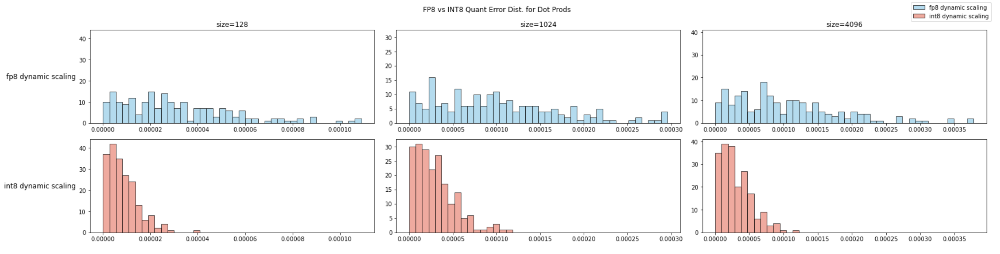
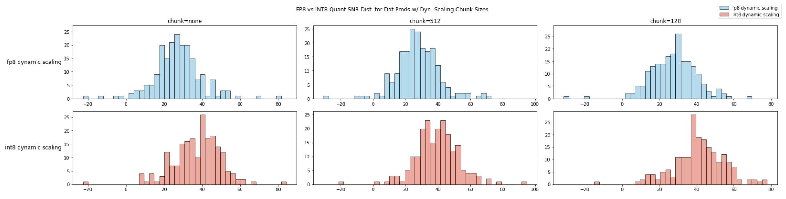
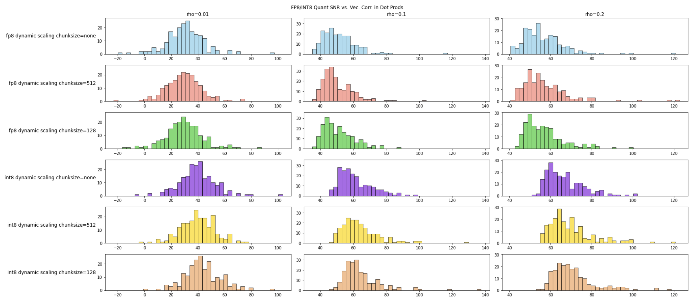

在 [前一篇博客](//2025/02/12/fp8_training/) 中，我们深入探讨了DeepSeek V3如何通过FP8实现高效训练，并成功克服了精度挑战。本文探讨另一个问题：如果用INT8代替FP8做训练，会发生什么？

## INT8 量化

给定一个浮点数向量 $x \in \mathbb{R}^n$，INT8量化的目标是将其映射到 [-128, 127] 的整数空间。这一过程需要确定缩放因子 $\alpha$ 和零点偏移 $\beta$，使得：

$$ x_q = round(\frac{x}{\alpha}) + \beta $$

其中 $x_q$ 表示量化后的INT8值。缩放因子 $\alpha$ 通常通过以下方式计算：

$$ \alpha = \frac{max(|x|)}{127} $$

这确保了量化后的值不会超出INT8的表示范围。而零点偏移 $\beta$ 在对称量化场景下通常设置为0，在非对称量化时则需要根据数据分布来确定。

对于LLM训练场景，由于权重和激活值通常呈现对称分布，我们可以使用对称量化方案：

```python
def symmetric_quantize(x: torch.Tensor) -> Tuple[torch.Tensor, float]:
    alpha = x.abs().max() / 127.0  # 计算缩放因子
    x_q = torch.round(x / alpha)   # 量化
    x_q = torch.clamp(x_q, -128, 127)  # 截断
    return x_q, alpha
```

反量化操作则是将INT8值映射回浮点数空间：

$$ x_r = (x_q - \beta) \times \alpha $$

其中 $x_r$ 是反量化后的浮点数值。在对称量化场景下，由于 $\beta = 0$，反量化简化为：

```python
def symmetric_dequantize(x_q: torch.Tensor, alpha: float) -> torch.Tensor:
    return x_q * alpha
```

与FP8的浮点量化不同，INT8采用均匀量化方案：

- 优势区间：大值区域精度更高（固定量化步长）
- 劣势区间：小值区域精度较低（相对误差更大）

这种特性使得INT8对数据分布形态更为敏感，需要针对性优化策略。

<!-- more -->

## INT8量化误差分析

针对3种不同的向量长度（128/1024/4096）分别进行200次向量内积实验，并分别计算FP8与INT8量化噪声分布：



从定性分析来看，INT8的绝对误差的分布更加集中在零附近，且最差情况也优于FP8。我们进一步引入分块量化，看INT8量化方法的上限如何：



我们比较向量长度为4096情况下，使用分块动态scaling与高精度累加策略时FP8与INT8向量内积的信噪比。 相同的chunksize下，INT8的信噪比略优于FP8。

最后，我们对比下向量相关性对量化噪声的影响。实验使用长度为4096的向量，对比在$\rho \in [0.01, 0.1, 0.2]$三种情况下的信噪比：



实验发现，在相同相关性条件下，分块量化的INT8内积信噪比优于FP8，且分块大小为512的INT8信噪比优于分块大小128的FP8。具体实验代码见：https://github.com/reiase/ieee754_simulation/blob/master/simfloat_fp8_vs_int8.ipynb

## 一些讨论

通过信噪比的实验，我们发现使用分块量化的 INT8 向量内积精度并不逊于FP8，信噪比分布甚至优于相同配置的FP8。实验过程中也发现量化时的舍入策略对信噪比影响巨大，必须严格使用四舍五入的舍入策略才能保证INT8的精度。单纯从信噪比来看，如果仅仅像TransformerEngine那样替代LLM中原有的矩阵乘法，分块量化的INT8应该不会有太大问题。推理阶段也可以使用类似LLM.int8的方法[^llm.int8]来保证精度。

FP8 E4M3的最大值为448，而INT8的最大值为127。动态范围上FP8 E4M3并没有太多优势。DeepSeek的FP8方案的成功证明了E5M2这个高动态范围格式比较鸡肋，徒增复杂度。另一方面也启发了对E4M3格式的进一步探索：是否可以进一步舍弃E4M3的指数量化，而该用INT8的均匀量化。

[^llm.int8]: [LLM.int8(): 8-bit Matrix Multiplication for Transformers at Scale](https://arxiv.org/pdf/2208.07339)