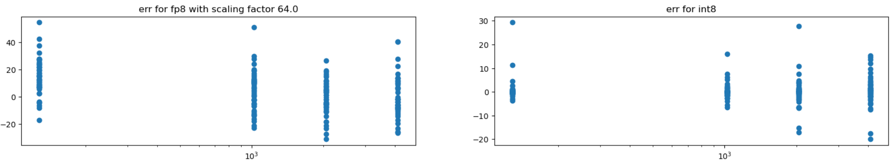
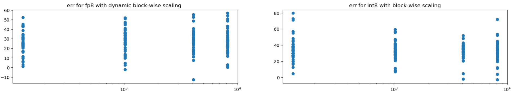

在[前一篇博客中](./003%20FP8与低精度训练.md)分析了DeepSeek V3如何使用FP8训练，怎么克服潜在的精度问题。使用相同方法对INT8处理向量内积运算的数值精度进行研究，发现运算的信噪比并不比FP8差很多。

## INT8 量化

给定一个浮点数向量 $x \in \mathbb{R}^n$，INT8量化的目标是将其映射到 [-128, 127] 的整数空间。这个过程需要确定缩放因子 $\alpha$ 与零点偏移 $\beta$，使得：

$$ x_q = round(\frac{x}{\alpha}) + \beta $$

其中 $x_q$ 表示量化后的INT8值。缩放因子 $\alpha$ 通常通过以下方式计算：

$$ \alpha = \frac{max(|x|)}{127} $$

这确保了量化后的值不会超出INT8的表示范围。而零点偏移 $\beta$ 在对称量化场景下通常设置为0，在非对称量化时则需要根据数据分布来确定。

对于LLM训练场景，由于权重和激活值通常呈现对称分布，我们可以使用对称量化方案：

```python
def symmetric_quantize(x: torch.Tensor) -> Tuple[torch.Tensor, float]:
    alpha = x.abs().max() / 127.0  # 计算缩放因子
    x_q = torch.round(x / alpha)   # 量化
    x_q = torch.clamp(x_q, -128, 127)  # 截断
    return x_q, alpha
```

反量化操作则是将INT8值映射回浮点数空间：

$$ x_r = (x_q - \beta) \times \alpha $$

其中 $x_r$ 是反量化后的浮点数值。在对称量化场景下，由于 $\beta = 0$，反量化简化为：

```python
def symmetric_dequantize(x_q: torch.Tensor, alpha: float) -> torch.Tensor:
    return x_q * alpha
```

与FP8不同，INT8量化是均匀量化，也就是说相邻的两个量化级别之间的间隔是固定的。这意味着INT8在0附近的精度不如FP8，但在较大值附近的精度可能优于FP8。这种特性使得INT8在处理某些分布较为均匀的数据时可能会有更好的表现。

<!-- more -->

## INT8量化误差分析

针对4种不同的向量长度，128/1024/2048/4096，分别进行50次向量内积实验，并分别计算FP8与INT8量化的信噪比：



定性来看，信噪比相比FP8并不很差。进一步引入分块量化，看INT8量化方法的上限如何：



使用分块大小128时，INT8量化方法的信噪比与FP8其互相当，甚至在部分向量长度下甚至略好一些。具体实验代码见：https://github.com/reiase/ieee754_simulation/blob/master/simfloat_fp8_vs_int8.ipynb
