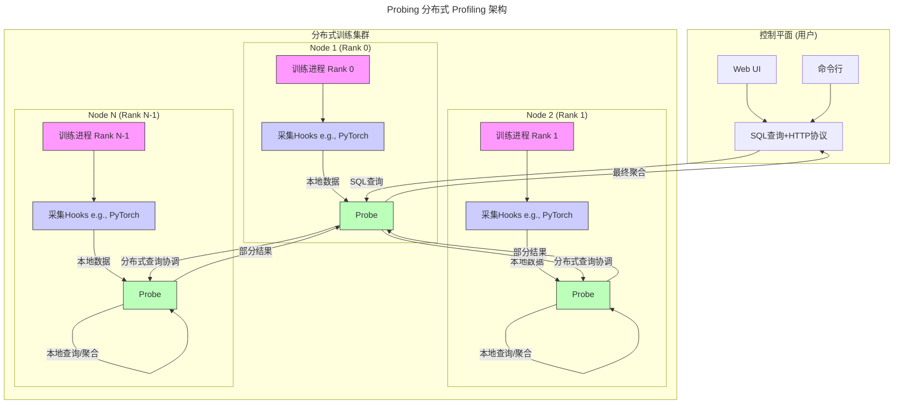

在前两篇系列文章中，介绍了 Probing 分布式探针的核心理念与技术探索，包括其应对 ABI 兼容性挑战的动态注入机制，以及基于 DataFusion 构建的可扩展查询引擎。虽然仍处于技术原型阶段，但也确实看到了实现一个“完美”工具的可能性。最近在解决某千卡训练项目时，浪费了大量时间在实验、抓数据与复现等工作上，越来越感觉到传统工具的限制，也越来越急迫地需要将Probing推向生产。

## 传统Profiler的困境

Profiling是性能优化工程师最为主要的优化手段，为了分析性能我们有形形色色的Profiler工具。大到Intel VTune和Nvidia Insight这种系列工具，有着完备的分析工具与可视化手段，很多问题都能一目了然；小到`perf top`这样"简陋"的调用栈采样工具，得边看边猜整个系统的行为。但是这些工具有一个共同的问题：他们都是单机工具，并不能很好的解决分布式系统中的性能问题。比如，PyTorch提供了`torch.profiler`，一个强大的内置性能分析工具，使用也极为方便：

```python
from torch.profiler import profile, CPU, CUDA

with profile(activities=[CPU, CUDA]) as prof:
    for step in range(steps):
        train_one_step()
        prof.step()
```

`torch.profiler`能够抓取PyTorch中的算子执行与显存分配行为，并且可以通过Tensorboard对结果进行可视化。但对于千卡规模的分布式训练，`torch.profiler`还远远不够用：

1. 性能开销问题：profiler会显著影响性能，导致Profiling结果不准确；
2. 数据爆炸：单卡长生上G的数据，千卡需要上T存储；
3. 缺乏协调：各节点数据相互独立，难以进行关联分析，特别是引入模型并行之后；

## 思路转变：从Timeline到统计方法

### Timeline困境

单节点的性能分析中，Timeline技术备受追捧。原因无他：直观，每个阶段的执行，开销的资源与消耗的时间都可以在一个时间轴上精确展示出来。但是Timeline数据庞大，并且借助浏览器渲染时速度也欠佳。几个G的Timeline数据很快会让你的笔记本成为一个小火炉。Timeline也存在明显的局限性：

- 一般只能分析单个节点单个Step：
  - 多节点多Step的数据，看不过来（虽然有些人在此会很倔强）；
  - 每个Step都有差异，导致难以给出结论（可以给定性结论，但结论复现存在难度）；
- 难以捕捉这个系统的随机性与不确定性：
  - 单个节点单个Step是确定的，但是一千个节点的同一个Step，充满了随机性；
  - Timeline无法刻画出整个系统性能层面的统计特性，比如耗时的99线；
- 忽略了负载不均衡现象：
  - 在经典的Dense LLM中，因为模型并行会导致每个节点实际负载各不相同；
  - 在流行的MoE LLM中，专家路由也会导致计算负载不均衡问题；

上述这些问题难以在Timeline框架下靠修修补补来解决：

1. 在由上千节点与数千线缆构成的复杂计算集群中，节点与节点间互联必然存在随机性与不确定性，这正是分布式系统的核心挑战。因此，分布式系统的性能分析需要从单节点上精准timeline的个体样本方法**转向能够描述随机性与整体特性的统计方法**。

2. 单节点的Profiling数据量非常巨大，却又缺乏有效的数据压缩与处理手段。单机尚能撑住，扩展到千卡集群就直接原地爆炸。分布式Profiling必然需要**转向现代化的数据基建，全面拥抱分布式的数据存储与分析技术**。

3. 分布式系统中很难保证时间一致与时间精度，多机timeline很难进行对齐，也很难可视化分析（可以想象下一千张卡的timelime等你去看）。**如何在不依赖精准时间戳的情况下进行数据关联分析、识别性能异常节点(Stragglers)，也成为分布式系统性能分析的关键挑战**。

#### 分布式系统的统计思想

分布式系统最常见的性能分析范式是分布式Tracing，如OpenTelemetry这类系统已在微服务领域取得了成功，这些系统的核心理念可以适配到分布式训练环境：

1. **借鉴Span概念**：将训练过程分解自顶向下的、嵌套的span。前向传播、反向传播作为顶级Span，每个layer的计算作为子Span。这种层次化的视图只需要明确层次关系，而无须精确的时间戳对齐。

2. **优化采样策略**：不同于timeline的全量采样，分布式profiling可以通过设计采样策略来控制开销：
   - 结构化采样：根据模型结构进行采样而非完全随机采样；
   - 分布式采样：将采样操作分布到不同的节点，降低每个节点的采样量；

3. **分析效率**：模型训练中每个span内的计算量与通信量可以精确计算，结合span计时即可分析每一段时间的硬件利用率与瓶颈，而无须像timeline那样精需要精准的时间信息。

4. **统计视角替代精确时间线**：关注分布特性（均值、中位数、百分位数）而非单个精确时间点，使问题分析更符合分布式系统的随机性特质。

不过分布式训练的通信模式是集合通信而非调用树，可以尝试为训练系统单独设计一套分布式Profiling方案。

## 基于探针的分布式Profiling

训练系统分布式Profiling需要克服的主要困难有两个：

1. 没有配套的数据系统：训练过程中的数据大多数没有业务价值，不会配套专门的数据处理与存储系统；
2. 数据量庞大：每个GPU在一个训练Step内就会产生数万个事件，而总数据量会随着step树与节点数增长而快速爆炸；

Probing 的解决方案是：**本地化存储数据 + 分布式查询分析**，将数据存储和分析的压力分散到每个节点上。以下是一个简单的示意图，用于说明理想情况下probing如何工作：



在这个架构下，可以借助分布式查询系统，将过滤、采样与聚合操作下推到每个节点去执行，并结合良好设计的采样机制与策略来平衡性能分析的精度与开销。接下来是在这个架构下设计数据采集、存储和分析的链路

### 采集链路

#### 基于钩子的数据采集

虽然修改代码加日志是最直观的数据采集手段，也日志往往过于随意、缺乏设计，为后续的分析与使用带来困难。不修改代码采集数据就需要对代码进行自动插桩。好在PyTorch提供了钩子（Hooks）机制，能够"不侵入"代码的情况下完成插桩。

```python
from torch.optim.optimizer import register_optimizer_step_post_hook

register_optimizer_step_post_hook(optimizer_step_post_hook)
```

`register_optimizer_step_post_hook` 帮我们向torch注册一个钩子函数，在每个Optimzier完成`step()`调用后执行。这个插桩时机极为关键：

1. 模型已完成构建，可获取完整模型定义
2. 前向传播、反向传播与优化器都已完成预热

接下来，借助Python的垃圾回收(GC)机制与反射能力来捕获进程中的模型结构：

```python
def get_toplevel_module():
    import gc

    import torch

    objs = [obj for obj in gc.get_objects() if isinstance(obj, torch.nn.Module)]
    is_child = set()
    for obj in objs:
        for child in obj.children():
            is_child.add(id(child))
    return [obj for obj in objs if id(obj) not in is_child]
```

通过`gc`模块我们可以获得当前进程中的全部Python对象列表，再通过反射调用`isinstance(obj, torch.nn.Module)`找出全部`torch.nn.Module`对象。最后再根据module之间的父子关系来发现顶层Module。

获取顶层Module后，我们可以注册完整的前向/反向传播钩子链，完成接下来的插桩：

1. Module.register_forward_pre_hook - 前向传播开始前
2. Module.register_forward_hook - 前向传播完成后
3. Module.register_full_backward_pre_hook - 反向传播开始前
4. Module.register_full_backward_hook - 反向传播完成后
5. Optimizer.register_step_pre_hook - 优化器步骤开始前
6. Optimizer.register_step_post_hook - 优化器步骤完成后

这些钩子构成了训练过程中的完整监控链，允许我们精确测量模型各组件的执行性能。

#### 结构化采样

考虑到PyTorch模型包含大量嵌套子模块，对每个模块都执行计时操作会带来显著性能开销。随机采样虽然能够降低插桩的开销，但需要等待较长时间才能保证采样充分。这里我们引入一种结构化采样方法来加速性能数据的采集：

1. span分解：将模型执行分解为一系列span，每个module的前向和反向传播分别构成独立span
2. 层次化排序：按照嵌套关系对span进行排序
    - 粗粒度span（如整个模型的前向传播）排序靠前
    - 细粒度span（如单个卷积层的操作）排序靠后
3. 自适应采样：从粗到细逐步采样
    - 命中采样时，记录当前span计时，并移至下一个span
    - 未命中采样时，跳过计算以减少开销

这种结构化采样确保每个训练步骤只对一个特定粒度的span进行采样，使模型性能分析由粗到细逐步进行，在控制开销的同时提供全面性能视图。

### 基于CUDA Event的精确计时

GPU上异步执行的计时通常通过CUDA Event来实现。CUDA Event能保证在CUDA Stream上的执行顺序，并且是测量GPU操作时间的最准确方式。一个CUDA Event的生命周期包括以下几个阶段：

1. 创建(Create)：通过torch.cuda.Event()或CUDA原生API创建Event对象
2. 记录(Record)：通过event.record()将Event标记到特定CUDA Stream的当前位置
3. 同步(Synchronize)：通过event.synchronize()等待Event标记的操作完成
4. 查询(Query)：通过event.query()非阻塞地检查Event是否完成
5. 计时(Elapsed Time)：通过start_event.elapsed_time(end_event)计算两个Event之间的时间差

在实际应用中，同步(Synchronize)操作会导致GPU等待并强制Stream清空，可能显著影响性能。为解决这一问题，我们采用延迟计时(Delayed Timing)策略，将时间读取推迟到优化器执行完成后进行。这种方法有效降低了计时操作对训练性能的干扰，特别适合分布式训练环境。

## 基于统计的性能/故障分析方法

在大规模分布式训练环境中，我们面临的不仅是如何采集数据，更重要的是如何有效利用这些数据发现并解决问题。Probing采用统计分析方法，将分散在各节点的性能数据转化为可操作的洞察。

### 分布式训练中的常见性能问题

在实践中，分布式训练的性能问题通常表现为以下几种典型模式：

1. 慢节点(Straggler)问题：个别节点显著慢于集群平均水平，拖慢整体训练进度
2. 负载不均衡：计算或内存负载在节点间分布不均，导致资源利用率低下
3. 通信瓶颈：节点间数据交换速度不足，制约训练效率提升
4. 异常波动：性能指标在时间维度上出现突发性异常
5. 集群分层：性能根据硬件配置或网络拓扑自然分层，形成性能梯队利用统计数据定位问题

### 节点性能差异分析

通过简单SQL查询，我们可以快速识别集群中的异常节点：

```SQL
-- 查找前向传播耗时异常的节点
SELECT 
    rank, 
    AVG(duration_ms) as avg_forward_time,
    COUNT(*) as sample_count,
    (AVG(duration_ms) - 
     (SELECT AVG(duration_ms) FROM torch_traces WHERE operation='forward')) 
     / (SELECT STDDEV(duration_ms) FROM torch_traces WHERE operation='forward') 
     as z_score
FROM python.torch_traces
WHERE operation = 'forward' AND step_id BETWEEN 100 AND 200
GROUP BY rank
HAVING z_score > 2.0  -- 标准差超过2倍的视为异常
ORDER BY avg_forward_time DESC;
```

这种查询允许我们立即发现性能显著偏离集群平均水平的节点，而无需手动检查每个节点的timeline。

### 层次性能分布图

分布式训练中，模型的不同组件在不同节点上的性能表现极具研究价值。Probing通过层次性能分布图直观展示这种多维度性能数据，帮助工程师快速定位瓶颈。通过Probing可以采集如下格式的数据：

```SQL
ts: 事件时间戳
node：节点名称
module：模块名称
stage：阶段名称，比如forward或者backward
mem_allocated: 已经分配的显存
mem_cached: 已经缓存的显存
duration：时间开销
```

通过对采集的结构化数据进行多维度聚合与可视化，我们可以构建如下分析图表：

```SQL
-- 分析每个模型层在不同节点上的性能分布
SELECT
    module,
    node,
    AVG(duration_ms) as avg_duration,
    PERCENTILE_CONT(0.5) WITHIN GROUP (ORDER BY duration_ms) as median,
    PERCENTILE_CONT(0.95) WITHIN GROUP (ORDER BY duration_ms) as p95,
    COUNT(*) as samples
FROM python.torch_traces
WHERE operation = 'forward' AND step_id BETWEEN 1000 AND 2000
GROUP BY module, node
ORDER BY module, avg_duration DESC;
```

这种查询能够生成深度学习模型中每个组件在集群不同节点上的性能热力图，通过这种热力图，我们可以立即观察到：

- 水平方向：同一节点上不同模型层的相对性能
- 垂直方向：同一模型层在不同节点上的性能差异
- 热点区域：特定节点-组件组合的性能异常

在一次实际分析中，我们通过层次性能分布图发现了某DNN模型中有趣的性能模式：

- 组件级差异：Attention层在所有节点上都比其他层耗时更长（水平模式）
- 节点级差异：特定的4个节点在处理卷积层时显著慢于其他节点（垂直模式）
- 交互效应：某些节点仅在处理特定类型的层时出现性能下降（局部热点）

### 时间维度的性能演变分析

分布式训练的性能问题常常随时间动态变化。通过跟踪关键指标的时间序列，我们可以发现潜在问题：

```SQL
-- 分析训练过程中的性能趋势
SELECT 
    FLOOR(step_id / 50) * 50 as step_bucket,  -- 按50步为单位分桶
    AVG(duration_ms) as avg_duration,
    STDDEV(duration_ms) / AVG(duration_ms) as cv  -- 变异系数
FROM torch_traces
WHERE operation = 'forward' 
GROUP BY step_bucket
ORDER BY step_bucket;
```

通过这种分析，我们可以发现：

- 训练初期的预热效应
- 性能随时间的逐渐劣化
- 可能的内存泄漏或资源竞争问题
- 周期性波动（如系统GC或后台任务影响）

### 分布式系统的层次化分析

在大型集群中，仅分析个体节点往往不够。Probing支持按网络拓扑、硬件型号等进行分组分析：

```SQL
 # 按网络拓扑分组分析通信性能
rack_perf = probe.sql("""
    SELECT 
        CASE 
            WHEN src_rank / 8 = dst_rank / 8 THEN 'same_node'
            WHEN src_rank / 32 = dst_rank / 32 THEN 'same_rack'
            ELSE 'cross_rack'
        END as topology,
        AVG(bytes_per_sec) as avg_bandwidth,
        COUNT(*) as sample_count
    FROM comm_events
    GROUP BY topology
""").fetchall()

for row in rack_perf:
    print(f"{row.topology}: {row.avg_bandwidth/1e9:.2f} GB/s ({row.sample_count} samples)")
# 输出:
# same_node: 87.32 GB/s (12453 samples)
# same_rack: 23.76 GB/s (8721 samples) 
# cross_rack: 11.89 GB/s (5432 samples)
```

这种分析揭示了网络拓扑对通信性能的影响，启发我们优化通信算法和数据分片策略以减少跨机架通信。
