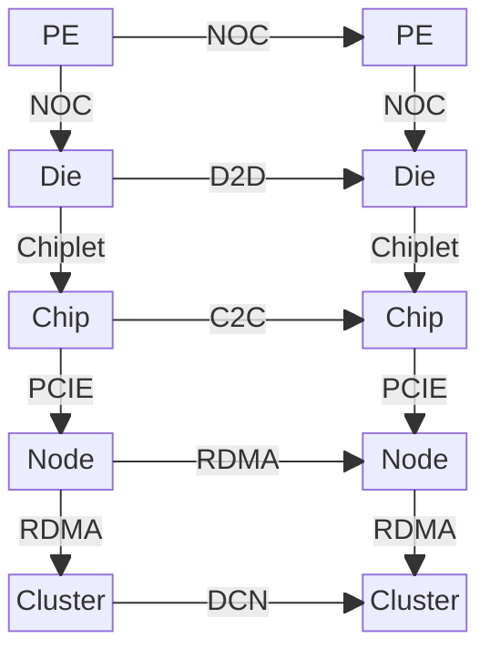
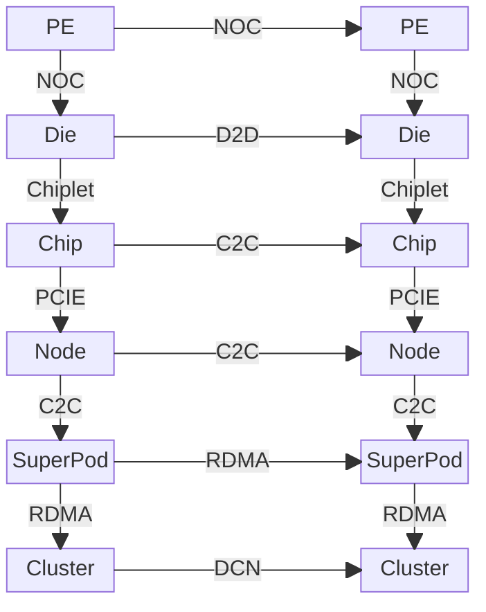
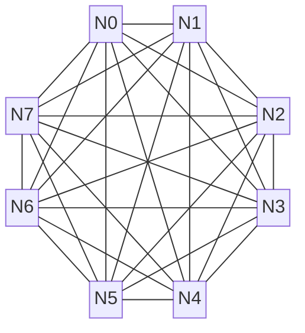

## 什么是超节点

超节点是借助高速无损互联技术，突破传统计算节点以CPU和PCIe总线为核心的通信域边界，所构建的新一代计算架构。**在硬件互联层面**，超节点采用 NVLink、CXL 或专用交换网络等先进互连协议，在加速卡（GPU/NPU）之间构建高带宽、低延迟的直接通信域（Scale-Up Domain，或 High Bandwidth Domain，HBD 域）。这种设计实现计算单元间的大规模、高效互连，从根本上缓解了传统架构中 GPU 间通信必须经由 CPU 与 PCIe 总线所形成的性能瓶颈，为巨量数据并行处理奠定物理基础。**在软件与系统层面**，其资源管理范式发生转变：硬件间高速通信往往直接绕过（bypass）操作系统内核的繁复协议栈，转而通过用户态集合通信库（如 NCCL、HCCL）进行调度，显著降低通信开销。

### NVIDIA超节点产品

2020年NVIDIA在其推出的HGX-A100系统中可以通过第二代NVSwitch将两个八卡A100通过背板方式进行连接，构成一个16卡的系统；2022年随Hopper推出的第三代NVSwitch可以支持更加灵活的组网方式，能够实现32颗GH200（32xGPU）的互联（NVL32）[^gh200]，最大可实现256颗GH100的互联（NVL256）；2024年Blackwell发布时，第四代NVSwitch能够实现32颗GB200（72xGPU）的互联（NVL72）[^gb200]，最大支持288颗GB200（576xGPU）的互联（NVL288）；而接下来发布Vera Rubin系列中，将会进一步实现144颗超级芯片的互联。以下是Hopper与Blackwell两代GPU所对应的超节点产品：

|              参数 |          NVL32          |      GH200 SuperPod       |          NVL72           |     GB200 SuperPod      |
|------------------:|:-----------------------:|:-------------------------:|:------------------------:|:-----------------------:|
|          **架构** |         Hopper          |          Hopper           |        Blackwell         |        Blackwell        |
|      **HBM 大小** |   32 x 144GB = 4.6 TB   |   256 x 96GB = 24.5 TB    |   36 x 384GB = 13.8 TB   |  288 x 384GB = 110 TB   |
|  **LPDDR5X 大小** |  32 x 480GB = 15.4 TB   |   256 x 480GB = 123 TB    |   36 x 480GB = 17.3 TB   |  288 x 480GB = 138 TB   |
|      **HBM 带宽** |        3.35 TB/s        |         4.8 TB/s          |          8 TB/s          |         8 TB/s          |
|  **FP16 (FLOPS)** |      32 PetaFLOPS       |       256 PetaFLOPS       |      180 PetaFLOPS       |     1440 PetaFLOPS      |
|    **INT8 (OPS)** |       64 PetaOPS        |        64 PetaOPS         |       360 PetaOPS        |      2880 PetaOPS       |
|   **FP8 (FLOPS)** |      64 PetaFLOPS       |       64 PetaFLOPS        |      360 PetaFLOPS       |     2880 PetaFLOPS      |
|   **FP6 (FLOPS)** |           N/A           |            N/A            |      360 PetaFLOPS       |     2880 PetaFLOPS      |
|   **FP4 (FLOPS)** |           N/A           |            N/A            |      720 PetaFLOPS       |     5760 PetaFLOPS      |
|  **GPU-GPU 带宽** |        0.9 TB/s         |         0.9 TB/s          |         1.8 TB/s         |        1.8 TB/s         |
|      **NVSwitch** |      Gen3 64 Port       |       Gen3 64 Port        |       Gen4 72 Port       |      Gen4 72 Port       |
|   **NVLink 带宽** | 36 x 0.9 TB/s = 32 TB/s | 256 x 0.9 TB/s = 230 TB/s | 72 x 1.8 TB/s = 130 TB/s | 576 x 1.8 TB/s = 1 PB/s |
| **Ethernet 带宽** |      16 x 200 Gb/s      |      256 x 200 Gb/s       |      18 x 400 Gb/s       |     576 x 400 Gb/s      |
|       **IB 带宽** |      32 x 400 Gb/s      |      256 x 400 Gb/s       |      72 x 800 Gb/s       |     576 x 800 Gb/s      |
|    **GPUs Power** |    32 x 1 kW = 32 kW    |    256 x 1 kW = 256 kW    |  36 x 2.7 kW = 97.2 kW   |      Not provided       |

### 超节点技术趋势分析

回顾从 Volta 到 Rubin 系列的演进，NVIDIA 的技术战略极为清晰：**通过算力、互联、存储和封装等多个维度的协同创新，实现系统层面的指数级性能增长。** 其目标是每两年提供约 6 倍的系统算力提升，并计划在十年内实现 7000 倍的增长。这种复合式增长并非依赖单一技术突破，而是通过一套精心设计的“组合拳”实现：
*   **单芯片算力**：每代提升约 3 倍。
*   **Scale-Up 域**：互联规模和带宽同步翻倍。
*   **内存系统**：HBM 带宽翻倍，容量提升 3 倍。

从 Blackwell 架构开始，**先进封装** 成为其算力增长的又一关键支点。通过 NV-HBI（NVIDIA High-Bandwidth Interface）技术[^nvhbi]，NVIDIA 将两颗 GPU 裸片（Die）高速互联，提供高达 10 TB/s 的双向带宽，使它们在逻辑上可作为单一、统一的 GPU 工作。这标志着 NVIDIA 的增长引擎已从单纯提升单点指标（如芯片算力或互联速率），全面转向以系统为单位的整体工程优化，从而确保了稳定且可预测的性能飞跃。

| 系列           | Volta               | Ampere                 | Hopper                | Blackwell            | Rubin            |
|----------------|---------------------|------------------------|-----------------------|----------------------|------------------|
| SKU            | V100                | A100(HGX)              | GH200(CPU+GPU)        | GB200(CPU+2GPU)      | ?VR200(CPU+2GPU) |
| 单卡算力（FP16） | 0.125 PFLOPS        | 0.312 PFLOPS           | 0.9 PFLOPS            | 2.25 PFLOPS x 2      |                  |
| 系统规模       | 8                   | 16(OEM提供)[^hgx_a100] | 32                    | 72                   |                  |
| 系统总算力     | 1 PFLOPS            | 5 PFLOPS               | 32 PFLOPS             | 180 PFLOPS           |                  |
| 系统HBM总容量  | 8 x 32GB = 0.256 TB | 16 x 80GB = 1.28 TB    | 32 x 144GB = 4.6 TB\| | 36 x 384GB = 13.8 TB |                  |

由此可见，超节点已成为驱动算力持续指数级增长的核心引擎。它的实现并非简单依赖于NVLink等某一单点技术的突破，而是一个将硬件、软件与应用范式深度融合的系统工程。为了系统性地拆解这一架构，本文将从硬件基石与软件生态两个层面展开详细论述。

## 超节点硬件系统

如前文所述，超节点是通过系统级的创新来支撑算力曲线的继续指数级增长。之所以要突破传统的"Scale-Out"扩展AI集群的范式，主要原因在于：

- **通信瓶颈**：PCIE与以太网的带宽增长难以匹配NVLink每两年带宽翻倍的快速增长。以H100为例，NVLink 4.0提供900GB/s的GPU间带宽，而PCIe 5.0 x16仅128GB/s，相差7倍。随着模型规模增长，这种差距会成为整个AI算力集群的核心瓶颈；
- **内存墙问题**：单节点GPU的显存容量有限，单纯HBM的迭代节奏难以满足大模型以模型规模和序列长度所驱动的显存需求快速增长。GPT-4级别的模型需要数TB的显存，远超单节点8卡GPU的容量；
- **扩展效率递减**：在Scale-Out域算力利用率随节点规模的增长而衰减；

超节点通过"Scale-Up"架构创新性地解决了这些问题：在机柜级别构建高速无损互联域，将数十甚至数百个GPU通过NVLink/NVSwitch直接互联，形成一个逻辑上的"超级GPU"。这种架构转变不仅仅是技术参数的升级，更是AI基础设施设计理念的根本性变革。为了系统性地理解超节点硬件架构，我们需要从多芯片系统的互联层次出发，分析从微观到宏观的技术栈如何协同工作，最终支撑起大规模AI训练的需求。下图展示了从处理单元到集群的完整硬件构建蓝图，其中超节点最大的创新在于引入了"SuperPod"这一新层级，彻底改变了传统AI集群的互联拓扑。

  

  

  常规AI算力集群
  

  

  

  

  超节点AI算力集群
  

  

现代AI超算系统的硬件架构遵循自底向上的层次化设计原则，每一层都通过特定的互联技术将计算单元组织成更大规模的计算资源。这种层次化设计不仅体现了硬件工程的物理约束，也反映了系统架构师从微观到宏观的资源组织思维：

1.  **层级1 - 芯粒内部 (Die)**: 系统的最基本计算单元是 **处理单元 (PE)** ，例如GPU中的流式多处理器(SM)。在单个硅片(**Die**)上，众多的PE通过 **片上网络 (NoC)** 高效互联。
2.  **层级2 - 芯片 (Chip)**: 借助先进封装技术(Chiplet)，多个独立的 **芯粒 (Die)** 被封装在一起，构成一个完整的 **芯片 (Chip)** 。它们之间通过高速的 **Die-to-Die (D2D)** 接口（如NV-HBI, UCIe）通信，使其在逻辑上表现得像一个单片大芯片。
3.  **层级3 - 节点 (Node)**: 一个服务器 **节点 (Node)** 通常包含多个 **芯片 (Chip)**（如多块GPU）和CPU。节点内的GPU之间通过 **芯片间互联 (C2C)** 技术（如NVLink + NVSwitch）构建高速通信域，而GPU与CPU之间则主要通过 **PCIe总线** 连接。
4.  **层级4 - 集群 (Cluster)**: 多个 **节点 (Node)** 组合成一个 **集群 (Cluster)**。节点之间的通信（Scale-Out）依赖于 **数据中心网络** ，通常使用基于 **RDMA** 的InfiniBand或RoCE高速网络。

### 硬件互联技术

超节点的核心特征在于通过高速无损互联技术构建大规模计算域。其互联体系遵循从微观到宏观的层次化结构，从芯片内部的片上网络到集群级的数据中心网络，形成了完整的互联技术栈。典型的多芯片计算系统互联结构如下图所示：

![[芯片互联.drawio.svg]]

芯片（Chip）通常由不同的芯粒（Chiplet）组成，比如CCD（Core Complex Die）和IOD（I/O Die）。其中前者通常包含CPU或者GPU的主要计算单元，而后者则负责PCIE、内存控制器等IO相关功能。通过CCD与IOD不同数量与规格的组合，可以制造出不同规格的芯片产品。在每个Die内部，通常使用片上网络（network on chip， NOC）来将处理单元（Processing Element， PE）组织起来，形成GPU上的计算单元，比如Streaming Multiprocessor（SM）。而Die之间通过Die to Die（D2D）互联进行通信。芯片之间则通过Chip to Chip（C2C）互联进行通信。
不论是片上的NOC通信，还是D2D、C2C通信，都可以在逻辑上分为三层抽象：

- 物理层：负责定义互联的物理形态、连接拓扑与信号的电气特性（频率、电压等）
- 链路层：负责定义数据如何进行传递高效可靠的传递，不负责理解数据的内容
- 事务层：负责定义事务处理逻辑，比如读写请求、内存一致性等；

为了方便理解，我们通过一张表格描绘下当前NOC、D2D和C2C三层通信在物理、链路和事务三层之上有哪些选择

|           | 物理层                                                                                                                                                                            | 链路层                                                                                                                                                                          | 事务层                                                                                                                                                                                                 |
|-----------|-----------------------------------------------------------------------------------------------------------------------------------------------------------------------------------|---------------------------------------------------------------------------------------------------------------------------------------------------------------------------------|--------------------------------------------------------------------------------------------------------------------------------------------------------------------------------------------------------|
| Die内通信 | 自定义的金属走线 使用数字信号                                                                                                                                                  | NoC网络 包含路由算法的定义 流控机制和数据包定义                                                                                                                           | 片上总线协议，比如 AMBA AXI和AMBA CHI                                                                                                                                                                |
| Die间通信 | - **BoW (Bunch of Wires)**：OCP定义的简化的die-to-die互连物理层协议 - **UCIe PHY**：UCIE的物理层规范 - 私有规范，比如AMD Infinity Fabric PHY, Intel AIB/Foveros PHY            | **UCIe D2D Adapter**: 负责链路训练、管理、CRC校验、重传机制 **私有实现**: AMD/Intel的私有链路管理逻辑                                                                           | **私有实现**: AMD Infinity Fabric Protocol (支持一致性) **UCIe Protocol Layer**: 承载 **PCIe**, **CXL**, 和其他原生流协议(Streaming)                                                                |
| 片间通信  | - **CEI**: OIF制定的高速电气I/O规范，包含25.6G/56G/112G等多种规范 - **PCIe PHY**: 遵循或参考CEI - **NVLink PHY**: NVIDIA私有SerDes实现 - **以太网PHY**: 如以太网光/电模块 | **PCIe Link Layer**: 流量控制、ACK/NAK、数据包排序 **CXL.io Link Layer**: 复用PCIe的链路层 **NVLink Link Layer**: NVIDIA私有链路管理和流控 **Ethernet MAC Layer / RoCE** | **PCIe Transaction Layer**: 内存读写(RW)、配置、消息 **CXL (.cache & .mem)**: 实现缓存一致性、内存扩展 **NVLink Protocol**: GPU间P2P内存访问、原子操作 **TCP/IP, RoCEv2**: 基于以太网的应用层协议 |

### 电互联关键技术基础

#### 基础物理单元：Lane与SerDes

当前高速数字信号通信普遍采用串行通信技术。其基础物理单元是 **Lane**，一个 Lane 通常由两对差分信号线组成：一对用于发送（Tx），一对用于接收（Rx），从而实现全双工通信。无论是 PCIe、NVLink 还是高速以太网，都是通过将多个 Lane 聚合（bonding）来获得更高总带宽。

芯片内部的数据通常是并行的（如 64 位或 128 位），为了在 Lane 上进行高速串行传输，需要一种专门的电路负责并行数据与串行信号之间的转换。这种电路被称为 **SerDes** (Serializer/Deserializer，串行器/解串器)。SerDes 将芯片内部的并行数据转换为高速串行信号发送出去，并在接收端将串行信号转换回并行数据。因此，单条 Lane 的传输速率直接受 SerDes 的能力和传输介质（线缆、PCB走线）的物理特性限制。

#### 标准化接口：OIF-CEI规范

为了确保不同厂商设备间的互联互通，光互联论坛（OIF）制定了通用电气接口（CEI）规范，对电气接口的物理形态、电压、频率以及信号调制方式等进行了标准化。例如，CEI-56G/112G/224G 等规范定义了单通道（per-lane）在 56Gbps、112Gbps、224Gbps 速率下的接口标准，其中广泛使用了 PAM4（4-Level Pulse Amplitude Modulation）等高级调制技术来提升数据速率。这些规范被 PCIe、CXL、NVLink 和以太网等主流互联协议广泛采纳或参考，作为其物理层设计的基础。

#### 主流协议的CEI实现

PCIe 和 NVLink 作为两种主流的片间互联协议，其核心创新在于链路层与事务层，而在物理层则高度依赖成熟的电气标准。它们的物理层设计与 CEI 规范密切相关，通常会选择某个版本的 CEI 规范作为其 SerDes 设计的电气基础，从而在确保信号可靠性的前提下，专注于上层协议的优化。例如：
*   **PCIe**: PCIe 5.0 的 32 GT/s 速率在电气特性上参考了 OIF CEI-28G 标准。而到了 PCIe 6.0，其 64 GT/s 的速率采用了 PAM4 调制技术，其电气特性与 OIF CEI-56G 系列标准的设计原则更为接近。
*   **NVLink**: NVIDIA H100 GPU 使用的第四代 NVLink，其单 Lane 单向速率为 100 Gbps（采用PAM4调制，波特率为50Gbaud），这与 OIF CEI-56G-PAM4 标准的电气特性一致。未来的 NVLink 版本预计将继续跟进更高速率的 CEI-112G/224G 标准。

通过这种方式，PCIe 和 NVLink 等协议可以复用业界成熟的电气标准，专注于其上层协议的创新。因此，OIF-CEI 规范的演进路线图，也成为了预判整个互联技术发展的关键风向标。目前CEI规范的主要节点如下：

| 规范系列     | 发布年份 (约) | 单通道速率 (Gbps) | 调制方式 | 典型应用/参考协议                                 |
|:-------------|:--------------|:------------------|:---------|:--------------------------------------------------|
| **CEI-28G**  | ~2011         | 28                | NRZ      | 100G 以太网 (4x25G), PCIe 4.0/5.0, InfiniBand EDR |
| **CEI-56G**  | ~2017         | 56                | PAM4     | 200G/400G 以太网, PCIe 6.0, NVLink 4.0 (H100)     |
| **CEI-112G** | ~2022         | 112               | PAM4     | 800G 以太网, CXL 3.0, 下一代 NVLink               |
| **CEI-224G** | -             | 224               | PAM4     | 1.6T/3.2T 以太网, 未来高速互联                    |

<small>
*注：NRZ (Non-Return-to-Zero) 每符号传输 1 bit 数据，PAM4 (Pulse Amplitude Modulation 4-level) 每符号传输 2 bit 数据，在相同波特率下可实现双倍数据速率。*
</small>

OIF-CEI规范通常5-6年一个版本，每次发布新版本时速率翻倍。但是上文所提到的时间为定稿时间，在定稿前行业内就会有较多的讨论和实现。所以不能完全以规范的时间来推测相关产品的面世时间。

### 电互联交换芯片的演进

交换芯片(Switch ASIC)是构建互联网络的核心，其交换容量和SerDes速率直接决定网络总带宽和端口密度。根据应用场景不同，主要分为数据中心网络交换芯片和GPU专用交换芯片两类。

#### 数据中心网络交换芯片

以Broadcom Tomahawk系列为代表的数据中心交换芯片，其演进与OIF-CEI规范紧密相关：

| 交换容量 (Tbps) | SerDes 速率 (每Lane) | CEI 代际对应 | 代表芯片 (发布年) | 可支持的典型 4-Lane 端口 (示例)                      |
|:----------------|:---------------------|:-------------|:------------------|:-----------------------------------------------------|
| 3.2T            | 25G NRZ              | CEI-28G      | Tomahawk (2014)   | 32 x 100G (4x25G)                                    |
| 6.4T            | 25G NRZ              | CEI-28G      | Tomahawk 2 (2016) | 64 x 100G (4x25G)                                    |
| 12.8T           | 50G PAM4             | CEI-56G      | Tomahawk 3 (2018) | 64 x 200G (4x50G)                                    |
| 25.6T           | 100G PAM4            | CEI-112G     | Tomahawk 4 (2020) | 64 x 400G (4x100G)                                   |
| 51.2T           | 100G PAM4            | CEI-112G     | Tomahawk 5 (2022) | 128 x 400G (4x100G)                                  |
| 102.4T (预测)   | 200G PAM4            | CEI-224G     | 下一代 (≈2025+)   | 128 x 800G (4x200G) 或 64 x 1.6T (8x200G, 非 4-Lane) |

<small>
*注：上表中的“4-Lane 端口”指由 4 个 SerDes 通道组成的逻辑端口，在常见的国产GPU厂商中比较常见此种配置。例如，一个 100G 端口由 4x25G 组成，一个 400G 端口可由 4x100G 组成。随着 SerDes 速率翻倍，单芯片的总交换容量和端口速率也随之翻倍，这是网络技术演进的核心驱动力。*
</small>

Broadcom的高端交换芯片通常两年一代，并且交换容量翻倍。而从芯片产品面世到广泛被交换机使用大约也需要1-2年时间。此外从Broadcom芯片规格的发展也能看出，行业领先厂商对CEI标准的实现和落地会先于规范的制定。

#### GPU专用交换芯片：NVSwitch

NVSwitch 负责在单机或机柜域内构建 GPU 全互连（all-to-all / non‑blocking）通信结构，其能力随 NVLink 代际一起提升。提升路径主要有两种：增加每 GPU 可用的 NVLink 数量（link fan‑out）与提高单条 NVLink 的每方向速率。下表采用 “GB/s (双向)” 口径（NVIDIA 官方常用聚合带宽，= 2 × 单方向带宽；1 GB/s ≈ 8 Gb/s）。

| 代际  | GPU 架构  | 发布（约） | NVLink 版本 | 每 Link Lane 数 | 每 Lane 速率 (Gbps) | 每 Link 双向带宽 (GB/s) | 每 GPU Link 数 | 每 GPU 聚合双向带宽 (GB/s) | 典型单机/底板 GPU 数 | 可扩展最大 NVLink 域（官方宣称） | 备注                                                 |
|:------|:----------|:---------|:------------|:----------------|:--------------------|:------------------------|:---------------|:---------------------------|:---------------------|:-------------------------------|:-----------------------------------------------------|
| 第1代 | Volta     | 2018     | 2.0         | 8               | 25                  | 50                      | 6              | 300                        | 16                   | 16                             | 首次通过 NVSwitch 实现 16 GPU 全互连，每 Link 8 Lanes |
| 第2代 | Ampere    | 2020     | 3.0         | 4               | 50                  | 50                      | 12             | 600                        | 8                    | 16                             | Lane 数减半但速率翻倍，带宽不变但功耗优化             |
| 第3代 | Hopper    | 2022     | 4.0         | 4               | 100                 | 100                     | 18             | 1800                       | 8                    | 256**                          | Lane 速率翻倍至 100Gbps，每 Link 带宽翻倍             |
| 第4代 | Blackwell | 2025     | 5.0         | 4               | 200                 | 200                     | 18             | 3600                       | 72                   | 576***                         | Lane 速率再次翻倍至 200Gbps                          |

<small>
*注：NVIDIA NVSwitch缺乏官方公开的详细Spec数据，因此部分数据为根据产品介绍推测。如有不准确的地方欢迎反馈。*
</small>

### 互联拓扑

互联拓扑定义了计算节点（或GPU）间的物理连接方式与逻辑结构，它直接决定了整个系统的通信性能，包括带宽、延迟、扩展性和成本。在超节点架构中，选择合适的拓扑是构建高效、无阻塞通信域的基石。当前主流技术路径为电子分组交换（Electronic Packet Switching，EPS），而光学电路交换（Optical Circuit Switching，OCS）作为前沿方向也备受关注。我们首先以最为常见的 **Full Mesh拓扑** 为例来分析GPU的互联拓扑，以及互联拓扑有哪些关键性质。

**Full Mesh（全互联）** ，或称全连接（All-to-All），是理论上最理想的通信拓扑结构。网络中的每一个节点都与其他所有节点建立直接的点对点连接。

为了能够定量比较不同的互联拓扑，现需要引入一些关键指标：

- **网络直径（Network Diameter）**：网络直径是指网络中任意两个节点之间的最短路径长度，刻画了最坏情况下的通信延迟。Full Mesh拓扑任意两个节点直接连接，因此 **网络直接为1** 。在Fat-Tree拓扑中，任意两个节点间的通信最多只需经过“上行-下行”三跳（Leaf-Spine-Leaf），因此 **网络直径为3** 。
- **二分带宽（Bisection Bandwidth）**：二分带宽是指当网络被切成两半时，连接这两半部分的总通信能力。它反映了网络在最坏通信场景下的最大数据传输能力。在Full Mesh拓扑中，一半网络有 \(N/2\) 个节点，每个节点有 $N/2$ 条链路连接到另一半网络，因此Full Mesh拓扑的二分带宽为 $\dfrac{N}{2} \times \dfrac{N}{2} \times B = \dfrac{N^2}{4} B$ 。Fat Tree拓扑下，一半网络有 \(N/2\) 个节点，每个节点都能够和另一半网络全速率通信，因此Fat Tree拓扑的二分带宽为 $\dfrac{N}{2} B$。
- **径向扩展度（Radix Scalability）**：是指在给定交换芯片 radix 条件下的最大无阻塞集群规模 $N_{max}$ 。它衡量了在给定交换芯片端口数（R_switch）和终端设备接口数（R_dev）的条件下，一个拓扑理论上能构建的最大无阻塞集群规模。Full Mesh拓扑下，互联规模 $N_{max} = R_{dev} + 1$ ，Fat Tree拓扑下 $N_{max} = R_{switch}^2 / 2 / R_{dev}$ 。

接下来介绍构建Scale-Up域用的拓扑结构。

**Fat-Tree（胖树）** 拓扑是当前构建大规模、高性能计算和AI集群最主流的架构。它是一种分层的网络结构，其核心设计思想是：从网络边缘（终端节点）向核心（根方向）上行时，链路带宽逐级增加，确保任意两个节点间的通信都拥有充足的带宽资源，从而实现或逼近“无阻塞”通信。典型的胖树网络由“叶交换机”（Leaf Switches）和“脊交换机”（Spine Switches）组成。计算节点直接连接到叶交换机，每个叶交换机又与所有的脊交换机相连。这种结构保证了任意两个不同叶交换机下的节点通信最多只需经过“上行-下行”三跳（Leaf-Spine-Leaf）。Fat Tree拓扑具备如下特点：
  * **高带宽与无阻塞**：通过精心设计上行与下行链路的带宽比例（收敛比），胖树网络可以为All-to-All等复杂通信模式提供接近线速的聚合带宽。
  * **良好的扩展性**：可以通过增加Spine交换机或增加网络层级来平滑地扩展集群规模。
  * **高容错性**：任意一条链路或交换机故障，流量可以被重新路由到其他路径，不会导致单点失效。

NVIDIA的DGX SuperPOD架构本质上就是一个精心设计的两级Fat-Tree网络。
*   **Level 1**：在单个节点内部，多颗NVSwitch芯片构建了一个单级的、逻辑上完全无阻塞的全互联网络（Full Mesh），将域内所有GPU全互联起来；
*   **Level 2**： Level 1的NVSwitch再通过Level 2的NVSwitch进行互联，形成一个32卡的Scale Up通信域。

**Dragonfly拓扑**[^dragonfly] 是一种为超大规模计算设计的、旨在降低网络直径和成本的拓扑结构。它将路由器（交换机）和与之相连的计算节点组织成“组”（Group）。组内，路由器之间实现全互联（All-to-All）。组间，通过长距离的“全局链路”进行稀疏连接。Dragonfly拓扑具备如下特点：
  * **低网络直径**：任意两个节点间的通信路径非常短，通常最多只需一跳组内路由和一跳全局路由。
  * **成本效益**：相比于同等规模的全连接胖树，Dragonfly所需的全局链路和交换机端口更少，成本更低。

  {width="500"}

Dragonfly的挑战在于，全局链路相对稀疏，就像一个城市的主干道有限。如果路由策略不佳，所有流量都涌向少数几条主干道，就会造成严重的拥堵。因此，它必须依赖智能的、能感知全局负载的路由算法，动态地为数据包规划‘行车路线’，才能发挥其低延迟和成本优势。

**Torus拓扑**[^torus] 是一种规则的格状拓扑，在多维（如2D、3D、6D）网格的每个维度上都带有“环绕式”连接。每个节点都与其在各个维度上的“邻居”直接相连。Torus拓扑具备如下特点：
  * **优异的局部性**：非常适合具有邻近通信模式的科学计算应用（如气象模拟、流体力学），因为相邻节点间通信延迟极低。
  * **二分带宽较低**：将其切成两半时，横跨切面的链路数量相对较少，这意味着其全局All-to-All通信性能不如胖树。
  * **扩展性受限**：高维Torus布线复杂，扩展成本高。

**SlimFly拓扑** [^slimfly]：作为Dragonfly的演进，SlimFly是一种在给定交换机端口数下，能够以更少的网络直径和接近最优的二分带宽连接更多节点的拓扑结构。它在理论上被证明是构建超大规模网络最高效的拓扑之一，但其不规则的连接方式对物理布线和路由算法设计提出了极高挑战，目前更多处于学术研究和前沿探索阶段。

对于以All-to-All和All-Reduce为主导通信模式的AI大模型训练而言，胖树拓扑因其优越的全局带宽特性与确定的网络直径而成为事实上的标准选择。但另一方面Fat Tree所能达到的互联规模也受限于交换机容量。在超节点继续演进的过程中，对互联拓扑的探索也尤为重要：

| 拓扑      | 径向扩展度                                           | 网络直径               | 二分带宽                |
|-----------|------------------------------------------------------|------------------------|-------------------------|
| Full Mesh | $R_{dev} + 1$                                        | 1                      | $\dfrac{N^2}{4} B$      |
| Fat Tree  | $\dfrac{R_{switch}^2}{2 R_{dev}}$                    | 3                      | $\dfrac{N}{2} B$        |
| Dragonfly | $\dfrac{R_{switch}^4}{81 R_{dev}}$                   | $\le 3$                | $\approx \dfrac{N}{2}B$ |
| Torus     | 无上界                                               | $D \cdot \dfrac{k}{2}$ |                         |
| Slim Fly  | $\dfrac{32}{243} \times \dfrac{R_{switch}^3}{R_{dev}}$ | 2–3                    | 设计为接近满二分带宽    |

## 软件系统

### 软件系统架构
超节点通过 HBD 通信域打通不同物理节点间的存储、计算与通信资源，使得资源管理与分配部分超出了传统操作系统内核的直接管控。当前其资源使用仍普遍采用传统的 SPMD（Single Program Multiple Data，单程序多数据）编程范式，依赖集合通信库完成进程间通信。然而随着生态演进，新的系统架构与资源池化方案在持续发展，主要体现在以下几方面：
1. **单边通信**：传统集合通信库采用双边通信模式，即发送方与接收方需协同，通过缓冲区与标识符进行配对，数据通常经历“发送端张量 → 发送缓冲区 → 接收缓冲区 → 接收端张量”的多次拷贝才可被寄存器侧使用。近年来，在 DeepSeek 等应用推动下，基于内存语义的单边通信（如 NvSHMEM）快速发展，允许直接从远程张量加载到本地共享内存乃至寄存器，降低编程复杂度并减少延迟。
2. **虚拟地址语义**：早期 GPU 编程中，设备显存地址空间与用户进程地址空间隔离。随着 UVA（Unified Virtual Addressing）与 Peer Memory 技术的引入，单节点内通信更简洁高效。进一步地，借鉴 OpenSHMEM 等规范提出的 PGAS（Partitioned Global Address Space，分区全局地址空间）模型与“对称内存”概念，超节点通信域内正在形成基于内存语义的通信编址规范，为更高效、更透明的通信机制奠定基础。
3. **内存层级与内存池化**：典型加速卡中本地 HBM 显存带宽与经高速互联访问远程 GPU 显存的有效带宽差距约 2–4 倍。例如 Nvidia H100 的 HBM3e 峰值约 3.5 TB/s，而通过 NVLink 访问远程显存约 800 GB/s。跨卡访问虽仍逊于本地，但其延迟—带宽特性已足以支撑更细粒度的数据放置策略。Nvidia 在 GH200 系列中通过 NVLink-C2C 将 Grace CPU（Arm 核心）与两块 Hopper GPU 互联，并提供一致性内存模型（coherent memory model），使 Grace CPU 的 480G LPDDR 内存可被 Hopper GPU 使用。

随着硬件演进，软件侧显存地址模型与编程模型将逐步稳定。总体趋势是：CPU 侧已验证成功的地址空间与编程范式，会在 GPU 端逐步找到重新实现与落地的路径。

## 应用

### 应用范式变革

HBD 域的扩展正在重塑应用的开发与运行范式。传统分布式计算倾向将“计算”与“通信”划分为独立的大粒度阶段，并通过通信-计算重叠（Communication-Computation Overlapping）掩盖延迟、提升利用率。然而，这种相对“静态”的模式在不断涌现的新模型面前需要频繁重新设计并行策略，优化成本高。

MoE 模型的核心思想是为每个输入（Token）动态选择一部分“专家”（Experts）进行计算，而非动用整个模型，带来两个根本性变化：
1. 通信模式的变革：通信内容从传统用于同步的大块梯度数据，转变为海量 Token 级小消息（路由与数据交换）。超节点支持 GPU 绕过 CPU 与内核协议栈，直接借助单边通信（如 NvSHMEM）对远程显存执行读写，契合小消息、低延迟需求。
2. 负载均衡的变革：在传统 GPU 集群上实现专家并行（Expert Parallelism, EP）时，负载均衡困难：每个 Token 激活的专家组合不同，GPU 负载动态波动。传统方法依赖全局先验预测进行静态分配，既浪费显存（需为最坏情况预留），又难以做到请求级实时均衡。超节点结合更细粒度调度，可实时感知域内计算单元负载，将 Token 处理任务动态派发至相对空闲的专家上，实现更细粒度、接近实时的负载均衡，提升资源利用率。

## 参考文献

[^gb200]: [NVIDIA DGX GB200](https://resources.nvidia.com/en-us-dgx-systems/dgx-superpod-gb200-datasheet)
[^gh200]: [NVIDIA GH200 Grace Hopper
Superchip](https://resources.nvidia.com/en-us-data-center-overview-mc/en-us-data-center-overview/grace-hopper-superchip-datasheet-partner)
[^hgx_a100]: [NVIDIA HGX A100](https://www.nvidia.com/content/dam/en-zz/Solutions/Data-Center/HGX/a100-80gb-hgx-a100-datasheet-us-nvidia-1485640-r6-web.pdf)
[^nvhbi]: [Inside NVIDIA Blackwell Ultra: The Chip Powering the AI Factory Era](https://developer.nvidia.com/blog/inside-nvidia-blackwell-ultra-the-chip-powering-the-ai-factory-era/)
[^nvl32]: [NVIDIA GH200 Grace Hopper Superchip Architecture](https://resources.nvidia.com/en-us-grace-cpu/nvidia-grace-hopper?ncid=no-ncid)
[^dragonfly]: [Technology-Driven, Highly-Scalable Dragonfly Topology](https://ieeexplore.ieee.org/abstract/document/4556717)
[^torus]: [Understanding Torus Network Performance through Simulations](http://datasys.cs.iit.edu/reports/2014_GCASR14_paper-torus.pdf)
[^slimfly]: [Slim Fly: A Cost Effective Low-Diameter Network Topology](https://arxiv.org/pdf/1912.08968)