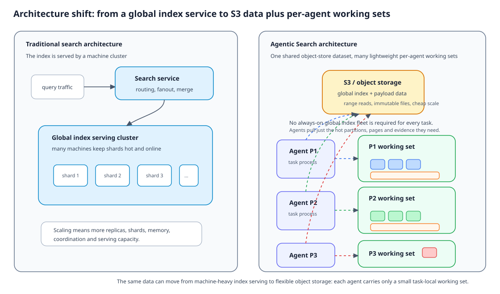
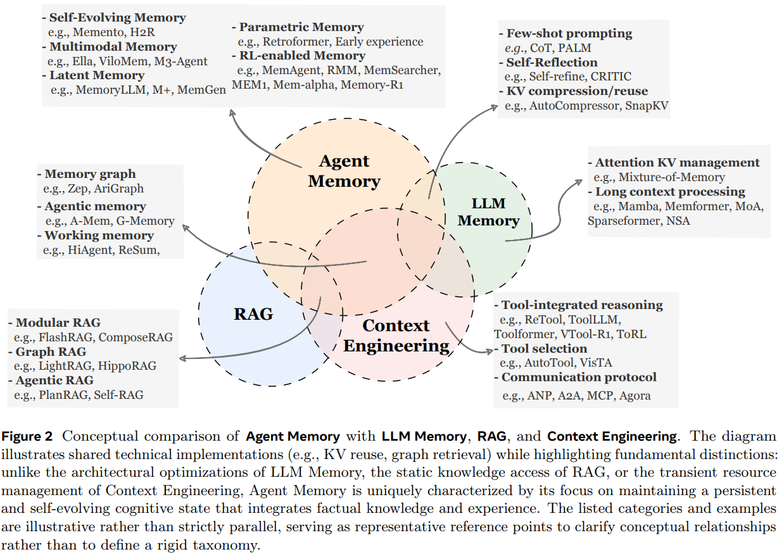
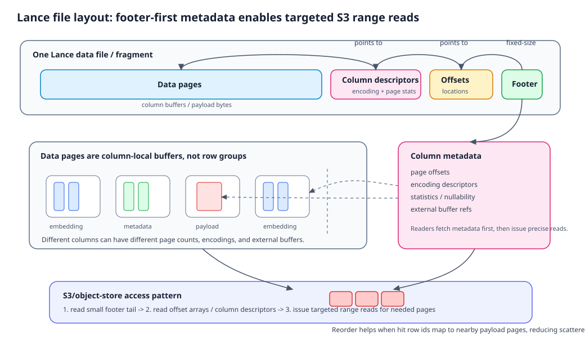
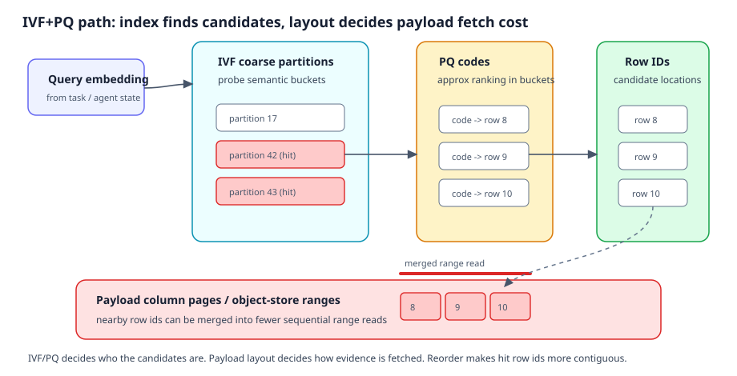
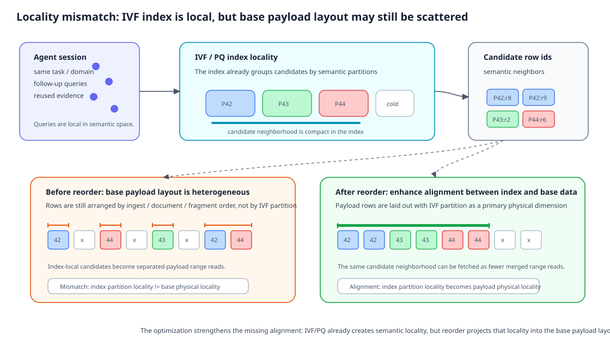
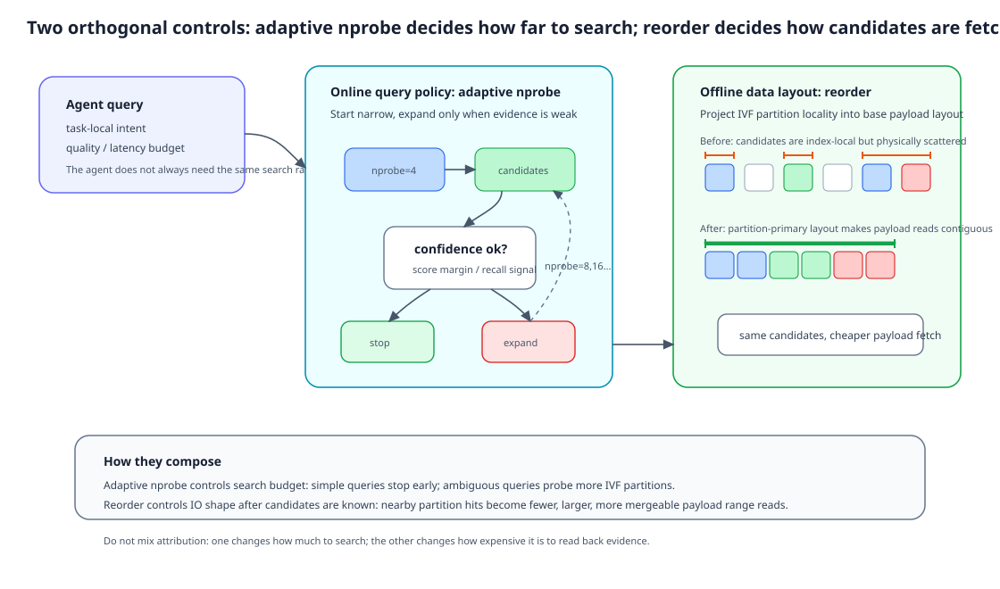
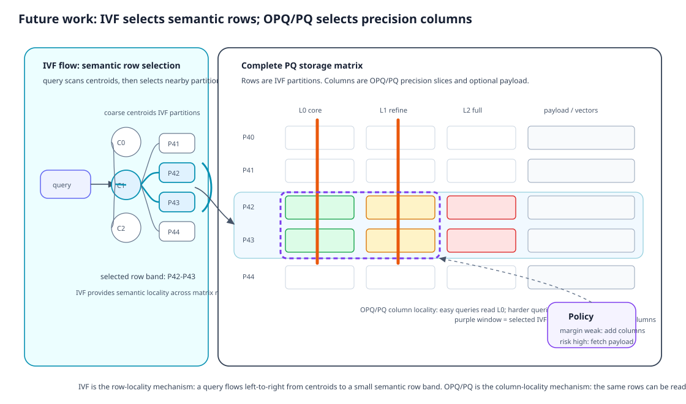

*本文为原创文章，版权归作者所有。未经许可，禁止转载。*

大模型推理看起来是 next-token prediction，但真实系统里的推理很少只是“生成”。提示模板、会话历史、长期记忆、检索结果、工具返回和数据库记录，都会进入推理链路。模型并不是在真空中猜下一个词，而是在“继续生成”和“引用已有信息”之间不断切换。

这也是大模型时代重新需要讨论存储的原因。存储不再只是“把东西放起来”，而是一套围绕 **可引用性** 建立的机制：让信息在合适的时刻、以合适的形态、用可控的成本被再次使用。问题也随之从“数据放在哪里”，变成了“引用路径如何被组织”。

Agent Search 把这个变化放大了。一个 Agent 很少只问一次；它会围绕同一个目标反复追问、调用工具、验证证据、修正计划。真正被反复触碰的往往不是整个知识库，而是当前任务附近的一小片局部工作集。全量数据仍然可以很大，也可以沉在对象存储里；靠近 Agent 的，则是少量语义相关的数据块、证据正文、工具结果和验证材料。存储系统的任务，就从“保存全量知识”变成了“让这些小工作集能被低成本地再次读出来”。

{width=100%}

<small>图 1：全局数据仍然可以很大，Agent 真正反复访问的是当前任务附近的一小片局部工作集。</small>

<!-- more -->

## 大模型场景中的“新”存储

如果说 2025 年大家都在谈 Agentic，那么到 2026 年，越来越多的讨论开始转向 Memory 与 Harness。这种转变说明市场已经不满足于“大模型能完成一次性任务”，而是希望它在长程任务里保持状态、继承进度、验证结果，并持续推进。长程任务会改变系统访问数据的方式：Agent 不再随机触碰全量知识库，而是围绕当前目标反复引用一小片状态、证据和工具结果。

### Memory：大模型面对长程任务的基础

Memory 不是把聊天记录永久保存下来，也不是一次推理里的临时上下文拼装。它是智能体可以跨交互、跨任务反复使用的状态基座：保存事实，也保存经验；保存用户偏好，也保存任务过程中的中间结论。

它和 RAG、Context Engineering 的边界也在这里。RAG 更像是访问静态外部知识库，Context Engineering 更像是在有限窗口里调度信息；Memory 关注的是一个持续存在的智能体，到底知道什么、经历了什么，以及这些状态如何随时间演化。

{width=100%}

<small>图 2：Memory 关注跨交互持续存在的状态；它和 RAG、Context Engineering 的区别，在于是否服务于一个持续演化的智能体。</small>

Memory 实际上就是模型侧对于存储的需求。事实记忆回答“智能体知道什么”，经验记忆回答“智能体如何改进自身”，工作记忆回答“智能体现在正在处理什么”。这些信息最终都要被组织成当前步骤可消费的状态。

在长程任务中，这些记忆会经历形成、演化和检索三个过程。其中，检索最直接地连接到后文的存储问题：何时检索、怎么构造 query、用什么策略取回、取回后怎么用，决定了模型能否维持“认知连续性”。

如果说 Memory 解决的是“状态如何留下来”，那么 Harness 解决的是“状态如何被外置成可执行、可验证、可交接的协议”。纯靠记忆系统的约束，大模型执行长程任务的效果并不总是理想，Harness 由此进入运行时系统。

### Harness：标准、证据与可执行环境

Anthropic 的文章把长程 agent 的核心挑战定义为：每个新 session 都 “no memory of what came before”，harness 的目的就是 bridge the gap between coding sessions。[^anthropic-long-running][^openai-harness] 可以把 Harness 理解为：让 agent 能稳定完成长程任务的一套外部工作环境与流程脚手架。它用一组可读、可执行、可持续迭代的工件，把多轮 / 多窗口会话串起来，避免每次新 session 都“从零开始”。

把视角从单次模型调用切到 Agent，存储问题会进一步扩展。Agent 需要引用的不只是知识库中的事实，还包括任务的当前状态、完成定义、工具使用方式、验证证据、历史决策与人类反馈。Agent 的长期能力很大一部分来自 harness，而不只来自模型参数。

长程 harness 解决的不是抽象“记忆力”问题，而是几个很具体的失败模式：agent 容易一次性做太多，做到一半耗尽上下文；下一轮接班时只能猜上一轮发生了什么；项目后期看到已有进展后，又可能过早宣布“已经完成”。对应的解法，是把任务状态、完成定义和验证证据外置成可引用工件：环境入口、进度日志、验收标准、版本历史和端到端测试证据。一个 `claude-progress.txt` 这样的文件，价值不在“记录得很详细”，而在于让下一轮 agent 不必凭空猜。

当“完成定义”和“验证证据”都被外置成可读工件后，运行时策略自然会趋向：优先引用这些工件与测试证据来推进任务；只有在证据不足或代价过高时，才回到纯生成补全。沿着这条思路继续走，Harness 也会扩展成 multi-agent system：Planner 负责规格，Generator 负责实现，Evaluator 负责验证。这里的关键不只是“多几个 agent”，而是把生成者和评价者拆开，让评价者更怀疑、更具体、更贴近验收标准。[^anthropic-harness-design][^claude-agent-sdk]

但是面对 Multi-agent system，Harness 复杂度不能无条件增加。每一个 planner、evaluator、context reset、subagent、sprint contract 或 review loop，都是在假设“当前模型单独做不好某件事”。当模型能力变化、任务类型变化、工具接口变化时，这些组件是否仍然必要，都需要重新验证。随着模型变强，一些原本必要的结构可能会变成开销；但在模型能力边界之外，Planner 和 Evaluator 仍然能带来真实提升。

这看起来会变成一个很复杂的工程优化，但它背后的关键矛盾其实很朴素：模型什么时候应该继续生成，什么时候应该停下来引用已有状态、规则、证据或工具结果。Memory 解决的是“哪些历史和经验值得长期留下来”，Harness 解决的是“哪些执行状态和验证标准必须被外置成工件”。两者最终都会落到同一个运行时选择：生成 token，还是引用 data。

### 原子决策：生成 token 还是引用 data

原生大模型的基本动作是预测，但 Agent 的基本动作是选择，是一系列“生成 / 引用”的序列决策。也就是说，长程任务和 Multi-agent system 的关键矛盾，都是生成 token 还是引用 data。

一旦把长程任务和多智能体协作抽象成“生成 / 引用”的序列决策，许多看似分散的模块就会落到同一张图上：上下文工程、长期记忆、RAG、搜索、工具调用、缓存、日志回放，都是外部可引用数据源；压缩、重排、裁剪、权限、TTL、命中率、延迟与 token 成本，都是围绕引用路径展开的系统优化。

我们以最常用的 Agentic Search 场景举例。Agentic Search 在传统视角下是一个纯引用 data 的过程，但大模型推理输出却由生成 + 引用共同组成。系统先判断哪些信息值得引用，再缩小候选、读回证据、压缩注入上下文，最后由模型继续生成：

```text
Memory / Harness / 领域数据
  -> 判断是否需要引用
  -> 找到相关候选
  -> 读回证据正文
  -> 重排 / 压缩 / 注入上下文
  -> 模型继续生成
```

这样抽象后，优化逻辑会变得更简单：系统不必被当成一个黑盒搜索服务，每次引用都可以拆成几个可独立调参的环节：

- 哪些信息值得引用：Memory / Harness
- 怎么缩小候选：embedding + metadata filter
- 候选怎么找：ANN
- 证据怎么读回：payload fetch
- 读回后怎么变成可消费上下文：rerank / compress / inject

每一步对应的指标也更直接：命中率、延迟、IO 次数、payload 字节、token 占用，以及“引用是否真的提升了结果”。

引用视角也支持任务拆分与并行协作。协作的对象不再是“共享一段复杂对话”，而是“共享一组可引用的外部工件”：检索到的证据、工具返回、评测结果、进度状态、缓存条目。只要写入格式稳定、可追溯、可回放，不同角色就能围绕同一批引用对象各做各的事：有人负责找证据，有人负责验证，有人负责压缩与注入，有人负责产出最终生成。

同样地，长程任务也不一定必然失控。真正让任务漂移的往往不是“跑得久”，而是“目标与状态不可引用”。当目标清晰、完成标准可引用、进度与证据可引用，Agent 即使跨多个上下文窗口运行，也能像工程流水线一样稳定推进：每一轮都在同一条引用路径上做增量改进，而不是在越来越长的对话里凭记忆续写。

从这个视角继续往下推，“引用”就不再是一个独立的新问题，而是存储问题的一个切面。凡是能被引用的东西，首先必须能被保存、被组织、被定位、被回查；引用只是在运行时把这条路径走一遍，并决定走到什么深度、付出多少成本。本文讨论的“引用优化”，本质是在讨论：哪些数据值得被放进推理链路，以及如何以可控代价把它们读出来。

这方面的工作可以借鉴互联网时代的经验。引用对应的就是一次搜索链路：召回、过滤、重排、压缩、注入；而被引用的内容最终一定要落到某种数据形态上：schema 怎么定义、payload 怎么切分、元数据怎么过滤、版本与权限怎么追溯、物理布局怎么决定回查成本。[^elasticsearch][^ragflow]

> 到这里，存储问题已经从“保存信息”收敛成“组织引用路径”：什么值得引用，如何找到，如何读回，以及读回后是否真的改善生成。

## 工程共识：格式、搜索与局部性

过去二十年里，搜索、推荐与数据分析系统各自积累的工程经验，并没有在大模型时代失效，只是被放进了新的引用链路里。

### Lance：从列式格式到可引用数据集

数据侧的存储关注的是：信息以什么形态存在，才真正能被模型和系统调用。原始内容本身通常不够。大模型场景中的一条数据，除了 text、image、audio、tool trace 等内容，还需要明确的类型与维度，例如任务类型、语言、领域、难度、时间、来源、权限、置信度、输出格式约束、上下文依赖等。这些维度决定了数据能否被路由、过滤、对齐、评测和追溯。

从 Markdown 到 Parquet，格式演进的终点不是“更复杂的文件”，而是让数据更容易被调用。轻量阶段需要规则、样本和 prompt 模板；规模上来以后，列投影、条件过滤、压缩和高吞吐扫描会变成底座能力。

但 Parquet 也有边界。Agent Search 不只是扫描结构化表，而是要在向量、结构化字段、长文本证据、工具轨迹和多模态内容之间做随机访问、过滤和回查。Lance 这类面向 AI 工作负载的格式，正是在这个方向上把“检索、随机访问、多模态存储”下沉为底座能力。[^lancedb-binary-data-lake]

#### 访问布局：从“找到候选”到“读回证据”

向量检索找到的是候选位置，但 Agent 最终需要读的是证据本身。如果候选背后的正文、工具结果、日志片段分散在很多地方，那么检索看起来已经结束，真正的等待却刚刚开始。

#### 一条样本不只是文本

在 Agent Search 里，一条样本通常不是单纯的文本。它至少包含三类信息：用于语义召回的向量，用于过滤、权限和路由的结构化信息，以及最终要交给重排器或模型阅读的证据正文。一个面向 AI 工作负载的存储格式，需要让这三类信息在同一份数据资产中协同工作。

可以把 Lance 粗略理解为一个面向随机访问和向量工作负载优化的列式数据集。它一方面保留列式格式适合过滤和扫描的能力，另一方面让向量、结构化字段和证据正文能被放在同一个数据集里统一索引、过滤、回查和版本化。

这和传统“对象存储放原文、数据库放路径、向量库放向量”的三套系统相比，有一个重要区别：这些信息不再只是松散拼接，而是能在同一个数据抽象下协同。对于 Agent Search 来说，这意味着“找到候选”和“读回证据”可以被放到一条更统一的引用路径里优化。

{width=100%}

<small>图 3：Lance 把向量、结构化字段和证据正文放到同一份数据抽象中，让“找到候选”和“读回证据”可以一起优化。</small>

#### 格式不只描述数据，也决定数据怎么被读

讨论存储格式时，很容易只看到逻辑层：有哪些列、字段类型是什么、向量维度是多少、过滤字段如何表达。但对 Agent Search 来说，格式还包含另一层同样重要的东西：访问布局。也就是说，当一批候选被召回之后，它们在文件里是挨在一起，还是散落在很多位置；证据正文能不能连续读出；无关数据能不能跳过。

可以把 Lance 在这里承担的角色拆成两层：

```text
逻辑层：向量 / 结构化字段 / 证据正文共同描述一条可引用样本
物理层：文件、列、数据页和行号决定这条样本如何被读出
```

逻辑层解决“这是什么数据、能不能被检索、能不能被过滤、能不能被模型引用”；物理层解决“这批数据被引用时，要发起多少次读取、读多少无关字节、能不能把相邻读取合并”。前者决定可调用性，后者决定调用成本。

这也是布局设计的意义。传统列式格式通常围绕分析型扫描优化：尽量只读相关列，利用压缩和统计信息减少全表扫描成本。Agent Search 的访问模式则更接近“先用向量索引找到一批候选，再按候选位置读回证据正文”。如果这些候选在物理上高度离散，系统就会面对大量小读取；如果它们在语义上相近、物理上也相近，读取器就更容易把多次回查合并。

因此，本次优化的着力点不是改变“这条数据长什么样”，而是改变“相似数据在物理上是否挨在一起”。在实验原型里，我把向量索引里已经形成的语义分组，投影到存储层的物理布局上：语义上相近的样本，尽量在文件里也更接近。后文把这件事称为紧凑布局；对应的实验命令只是原型实现细节，不是上游 Lance 默认能力。

### 向量索引：从候选到证据回查

但随着模型能力增强，越来越多系统会绕过完整 RAG 工程，直接把向量索引当成引用入口。向量检索通常不会把所有向量完整扫一遍，而是先把语义空间切成很多粗粒度区域，再只在少量相关区域里找候选。具体实现可以是 IVF、PQ 等索引结构；重要的不是这些名字，而是它们共同带来的访问模式：先找到候选，再读回候选背后的证据。

向量索引只解决了“候选在哪里”，但 Agent 真正需要引用的是候选背后的文本、工具结果、日志片段或文档上下文。对于少量候选查询，这个回查成本可能不显眼；但当系统需要读回较大候选集做重排、聚合或证据拼接时，读回证据正文就会成为引用路径里的主要成本之一。

候选如果在物理上高度离散，就会产生大量随机读；如果它们在文件里相邻，读取器就有机会把多个小读合并成更少的连续读取。到这里，语义检索问题已经变成了存储布局问题。

{width=100%}

<small>图 4：向量索引只决定候选在哪里；候选之后的证据回查，才把语义检索问题重新带回存储布局。</small>

### 局部特性：专用场景的优化

通用向量检索基准测试往往假设 query 分布近似均匀，但 Agent Search 的真实访问负载通常不是这样。同一个会话、同一个租户、同一批验证证据，会反复触达相近的语义区域；重排、评估和多轮验证也常常需要读回一批相关候选，而不是只取一个点。

如果向量索引中的语义分组能和证据正文的物理布局对齐，系统就有机会把语义上的相近访问转化为存储层的连续访问。

{width=100%}

<small>图 5：当语义上的相近访问能映射到物理上的相邻读取时，布局优化才有机会减少随机 IO。</small>

这里的关键变量可以称为连续性。在打散的数据中，向量索引虽然在语义空间里找到了相邻候选，但这些候选可能散落在不同文件块或对象存储区间上；一次 top-k 回查会退化成很多次小读取。紧凑布局之后，同一语义区域里的样本在物理上更接近，证据正文更容易被合并读取。连续性变好，并不一定意味着读字节必然更少，因为合并读取可能会顺手读入一些无关字节；但它通常会减少请求次数和随机 IO，这才是对象存储路径上最有价值的收益来源。

Agent Search 的局部性既可被观测，也可被量化、被压缩。即便不做任何重排，一组围绕同一领域反复追问的聚焦查询，和一组跨领域分散的查询，在底层读数据的形态上已经不同。这是 query 端语义聚合在 IO 层留下的“指纹”。这条信号是后续物理布局优化的原料：逻辑上的语义相邻越强，把它们在物理上放近的收益就越大。

#### 为什么少发几次读取请求很重要

在本地 NVMe 上，随机读和顺序读的差异已经足以影响延迟；到了对象存储路径，差异会进一步放大，因为每次读取都可能带来请求开销、网络往返和调度开销。此时，真正影响延迟的不只是读了多少字节，还包括读了多少次、每次读取之间是否可以合并、以及为了合并相邻区间额外读了多少无关字节。

读取器会尝试把相邻的小读取合并。当候选在物理上接近时，请求次数可以显著下降；但合并也可能带来额外读字节。旧直觉“少字节必更快”在这里并不总成立。对 Agent Search 来说，更接近实际延迟的变量，往往是读取次数、证据大小和对象存储路径上的网络往返共同作用。

看一项布局优化有没有真的“加速”，我习惯先看底层读取（请求次数、读字节）有没有下降，再看这份节约能不能穿过缓存、网络往返和解码开销，翻译成最终延迟。两层分开之后，会浮现出几种本质不同的形态：

- **底层读取真的变少，延迟也同步下降** ：这是最理想的情况，机制成立、边界稳定。
- **底层读取少了，但延迟没动** ：节约幅度太小，被路径上的其他开销盖住；机制成立，但还没翻译成用户感知时间。
- **读字节反而增加，延迟却能持平甚至下降** ：合并读取多带回了一些无关字节，但请求次数减少抵消了多读的代价；这时候“少字节必更快”的旧直觉就失效了。
- **字节数和请求数几乎不动，延迟却大幅波动** ：往往不是读取问题，而是解码、序列化或决策路径的代价，继续做存储布局优化解决不了。

把这四种情况分开看，工程决策才不会被一组好看的延迟数字误导。下文讨论紧凑重排、向量编码和查询策略时，都会回到这套两步判读上来。

> 这一节只留下一个判断：Agent Search 的存储问题，不在向量索引结束处结束，而是在候选背后的证据回查处重新开始。

## 局部性假设下的“新”优化

Memory 与 Harness 让长程任务围绕同一目标、同一批状态、同一组验证证据反复推进；Agent Search 则把这种语义聚集落到数据访问上。于是，一个长期被默认、但在 Agent 场景中更显著的前提浮现出来：局部性假设。语义相近的查询，会在时间、候选集与数据访问上呈现聚集。

只要局部性成立，优化目标就不再是“让单次检索更快”，而是“让相近的引用更便宜”。下面的「紧凑布局」「自适应检索预算」及配套实测，均建立在笔者对 Lance 的定制实现之上；其中思想（把语义相近变成物理相近、让查询预算动态变化）对同类列式存储与向量检索系统仍有一般参考价值。

### Reorder：打通物理存储布局

紧凑布局的目标很朴素：如果一批内容在语义上经常一起被访问，那么它们在物理上也最好尽量靠近。向量索引里的分组可以看作语义空间里的粗粒度“桶”；如果 Agent query 会反复命中相近的桶，那么这些桶里的证据正文最好在文件里也尽量接近。

这就是紧凑布局的核心思想：让同一语义分组里的样本在磁盘上更连续，从而让候选后的证据回查更容易被合并成少量连续读取。它优化的不是向量距离计算本身，而是“候选已经找到之后，证据如何被读回来”。

打个比方，这有点像把图书馆里经常一起被借的书，从分散在不同楼层的位置挪到相邻书架上。书的内容没有变，目录检索也没有变，但真正去取书时，来回跑的次数少了。

这个优化成立需要一个前提：查询确实会读回一批相关候选。如果 Agent 只取极少量结果，证据正文又很短，那么把一大段相近内容一起读出来，反而可能变成“读得多、用得少”的浪费。相反，当系统需要读回较多候选做重排、证据拼接或多轮验证时，被放近的样本就能被一次连续读取带回来，物理局部性的价值才稳定显现。

这条耦合关系还有一个推论：语义分组的大小并不是可以随手乱调的旋钮，它通常受数据规模和索引构建方式约束。分组太大，轻量查询容易多读；分组太小，连续读取的收益又会变弱。真正要判断的不是“紧凑布局好不好”，而是“当前查询会不会读回足够多相关证据”。

因此，紧凑布局不能写成“默认加速器”。它更准确的定位是： **当引用路径进入重候选、重证据、对象存储读取压力明显的区间时，把语义局部性转化为 IO 局部性的布局策略** 。

### Adaptive nprobe：动态控制索引预算

如果说紧凑布局改变的是“数据怎么放”，那么自适应检索预算改变的是“这次要找多深”。固定预算的做法，是每次查询都搜索同样大的语义范围；但 Agent Search 里有些 query 很明确，少量候选已经足够，有些 query 更开放，必须扩大搜索范围才能补齐召回。

自适应检索预算的思路，是从较小搜索范围开始，根据候选分数、margin 或置信度判断是否继续扩大搜索。它对应的是 Agent 内部更细粒度的“继续找 / 停止找”决策。本文不展开这部分实验数据，只把它作为和紧凑布局正交的策略侧机制：前者改查询预算，后者改物理布局；两者可以组合，但不能混在一起归因。

{width=100%}

<small>图 6：紧凑布局改变候选读回时的 IO 形态；自适应检索预算改变一次查询要搜索多大的语义范围。</small>

### 实测：不是所有查询都会变快

在上述 Lance 定制原型上，我对照了「打散」与「按语义分组紧凑」两种布局。实验对象是约 82 万条 Wikipedia 文本片段，384 维向量；为了避免首个查询的冷启动影响，主要观察进入稳态之后的查询；为了避免混入索引粒度变化，尽量只比较“物理顺序不同”这一件事。

> 物理布局只在重引用路径里稳定变成端到端延迟收益。

表中把查询按引用路径分成三类：只读少量短证据的轻路径，开始读回一批证据的中等路径，以及需要读回大量候选做重排、拼接或多轮验证的重路径。baseline 是同一索引粒度下被打散的物理顺序，compact 是按语义分组紧凑后的物理顺序；数字来自对象存储路径上的稳态查询，延迟为客户端端到端 p50。

| 引用路径 | 覆盖的查询形态 | 请求次数变化 | 读字节变化 | p50 延迟变化 |
| --- | --- | ---: | ---: | ---: |
| 轻引用路径 | 小 top-k，证据很短 | 约 -20% ~ -32% | 约 +63% ~ +108% | -14% ~ +12%，方向不稳定 |
| 中等引用路径 | 中等 top-k，开始读回一批证据 | 约 -48% ~ -54% | -29% ~ +18%，取决于查询聚焦度 | 约 -12% ~ -39% |
| <span class="table-row-highlight">重引用路径</span> | 大 top-k，重排 / 证据拼接 / 多轮验证 | 约 -41% ~ -54% | 约 -42% ~ -51% | 约 -31% ~ -45% |

<small>表 1：不同引用路径下的物理布局收益对比。负数表示下降；重引用路径上，请求次数、读字节与 p50 延迟同时下降，是紧凑布局最稳定的收益区间。</small>

!!! note "核心发现"
    中等引用路径本身是过渡区：查询足够聚焦时，合并读取开始兑现；查询分散、证据覆盖不足时，多读无关字节仍会吃掉一部分收益。

    轻引用路径属于“机制发生了，但没有稳定翻译成时间”的形态。重引用路径则不同：请求次数、读字节和 p50 延迟一起下降，说明紧凑布局真正压低了证据回查成本，并且这份 IO 节约穿过对象存储的网络往返，翻译成了用户可感知的端到端收益。

同一语境下，节约几乎都落在证据回查，索引侧变化很小。这也说明紧凑布局优化的是「候选已定之后怎么把证据读回来」，不是让向量距离算得更快。

语义分组内部再做更细的相邻排序，只在 **聚焦、反复追问** 一类 query 上还有一层边际收益；跨领域乱扫时，这层收益基本可以忽略。

反过来说，如果系统面对的是高度分散、近似随机的 query，或者每次只取极少量短证据，局部性假设就不强。此时紧凑布局不但可能没有明显收益，还可能因为合并读取带回无关字节而轻微劣化。这个边界很重要：布局优化服务的是有局部性的引用流，不是所有向量检索请求的通用加速器。

因此不要只问「数据集要不要开紧凑」，而要问：

- top-k 多大
- 证据多重
- 是否需要重排
- 是否走对象存储
- query 有没有会话或领域局部性

是否启用紧凑布局，更适合挂在 query 形态或策略层上选择，而不是做成 dataset 级一次性开关。

如果要把这件事带进生产环境，还需要补齐三个问题。

- **构建代价** ：当前原型可以理解为一次离线 rewrite，复杂度主要来自扫描、按语义分组重排和重写数据，规模上接近 `O(N)` 到 `O(N log N)`，具体耗时和额外 IO 需要在目标数据集上补测。
- **尾延迟** ：p50 下降不代表 p99 一定下降，对象存储路径上要看“少发很多小请求”和“发更少但更大的请求”哪一个尾部更重。
- **缓存 trade-off** ：真正有用的图不是单点延迟，而是打散 / 紧凑布局在小缓存、大缓存下的相对位置；如果“紧凑 + 小缓存”接近甚至优于“打散 + 大缓存”，部署决策才会变得清楚。

回头看，这也可以被写成一个离线排列优化问题：给定 `N` 条样本，每条样本属于某个语义分组，当前物理布局是一个行排列 `π0`；一条 Agent query 会命中若干语义分组，并取回一批候选行。目标是求一个新排列 `π`，让这些候选在 `π` 下的期望回查代价最小。

关键在于代价函数。本地 NVMe 上，代价可以近似成候选行跨越的 page 数或随机跳转次数；对象存储上，代价更接近“可合并后的读取请求数 + 为了合并多读的字节数”。

随机打散可以作为最简单的 baseline：假设候选行近似随机落到 `P` 个 page 中，取回 `r` 个候选时，期望触达 page 数约为 `P * (1 - (1 - 1/P)^r)`；当 `r` 远小于 `P` 时，它几乎等于 `r`。紧凑布局想做的事，就是利用语义分组把这些候选压到更少、更连续的 page 上。

### 向量编码：先把副本成本降下来

布局策略关注的是“相近证据怎么放”；向量编码关注的是另一个独立维度： **每条样本里的向量占多少空间** 。同样规模的 384 维向量数据集，使用不同的向量精度，存储体积可以从约 1.7 GB 一路压到不足 700 MB。

这条收益的特点是 **相对独立于查询路径** ：它不依赖具体查询负载、不依赖缓存命中率，也不依赖部署在本地 NVMe 还是对象存储。只要向量列在数据体积中占有足够比例，任何需要持有副本的部署形态——容器镜像、边缘缓存、对象存储分层、离线分发的分片数据集——都能直接拿到容量收益。对于 Agent Search 这种“全局知识库 + 大量小型本地副本”的场景，副本越多，单副本压低带来的成本节约越值钱。

向量精度对查询延迟的影响则是另一回事，并且方向不像存储侧那样统一。某些量化在重证据路径上能跟读取节约同向兑现一些延迟收益；但有些更复杂的精度重组方案会引入额外解码成本，让底层读取几乎不动、CPU 时间却明显波动。

所以更稳健的工程定位是： **把向量编码当作存储侧的密度工具来用，而不是查询加速器** 。先把存储成本压下来，查询时要不要付出更高精度成本，再交给上层策略根据具体负载决定。

### 缓存与局部性：小缓存也能吃到布局红利

「把缓存开大，布局就不重要」只说对了一半。缓存挡的是 **命中** 路径；真正咬人的往往是 **miss 时每一次读的物理代价** 。在这组 bench 中，把缓存从 GB 级收到 **约 256 MB** ，紧凑布局带来的稳态 IO 红利几乎不掉；再收到 **约 32 MB** ，仍能留住 **九成左右** 。布局优化的收益不必绑定几 GB 常驻内存。

!!! note "一个反直觉结果"
    在这组原型实验里，**约 32 MB 缓存已经能留住紧凑布局稳态收益的近九成**。这意味着局部性优化真正有价值的场景，未必是内存充裕的常驻服务，反而可能是容器、边缘节点和 serverless 这类内存预算紧的部署形态。

布局与缓存是叠加关系：命中率高时，没命中的次数更少，但每次没命中的读取仍可以更便宜；命中率低时，局部性几乎是唯一可重复的「热」。这对 **容器、边缘、serverless** 特别友好：内存预算紧时，更值得押在「怎么排」，而不是无限扩缓存。实务上，多数负载把客户端可读缓存上限收到 **256 MB 量级** 往往就够用；实验里更大的默认上限更像量程上限，而非日常必选项（与上游默认是否一致无关，此处仅描述笔者实验中的可调范围）。

冷启动时紧凑布局可能多触一点元数据 IO，体量通常不大；若 cache 过小，首批 query 可能短暂抬升。调缓存与开紧凑，最好一起权衡。

### 下一步计划：精度也可以按需展开

紧凑布局验证的是“语义上相近的数据，物理上是否也应该更近”。下一步更自然的问题是：**同一批候选，是否也应该按需读取不同精度**。

今天的向量索引通常在构建时就固定了精度与体积。但对 Agent Search 来说，更理想的形态是：简单查询先读取较低成本的核心信息，困难 query、候选分数接近或任务风险更高时，再增量读取更多精度，把排序质量逐步补上来。也就是说，局部性不只发生在“读哪些语义区域”上，也可能发生在“为这些候选读到多少精度”上。

计划中的实验会把索引看成一个二维引用矩阵：一维是语义局部性，决定读哪些区域；另一维是精度局部性，决定读多少精度切片。判断这条路线是否成立，也会沿用本文的两步判读：先看增量精度是否真的减少无效回查或提升候选排序稳定性，再看这份收益能否穿过解码成本、对象存储读取和 rerank 开销，翻译成最终延迟或质量收益。

{width=100%}

<small>图 7：渐进式索引把语义范围和索引精度都变成可调度预算：简单查询少读，困难查询再逐步加深。</small>

渐进式索引不是本文已经验证的结论，而是下一轮要验证的计划：把“搜索范围”和“索引精度”都变成 Policy 可以按 query 形态调度的成本维度。

## 总结：好的存储让引用变得更便宜

存储优化的目标，是让系统在推理过程中更稳定地完成生成与引用的决策。Memory 与 Harness 决定什么值得引用；数据格式与索引布局决定能否低成本引用；运行时决策决定引用多少、何时停止，以及如何权衡成本与质量。

在有局部性的重引用路径上，紧凑布局能更便宜地读回证据；在内存受限的部署形态里，几十 MB 级缓存也可以吃到大部分稳态收益。判断这类机制是否真的“加速”，要分两步看：先看底层读取是否真的变少，再看这份节约能不能穿过缓存、网络往返和解码开销，翻译成最终延迟。

存储优化到最后，不是在优化数据，而是在优化决策：让系统在合适的时候，用合适的成本，引用合适的状态。其余都是细节。

### 实验边界

本文的实验直接证明的是存储层结论：紧凑布局能在重引用路径上更便宜地读回证据。它没有直接测量模型少生成了多少 token，也没有测量任务成功率提升多少。更准确地说，好的存储不是自动让模型变聪明，而是把“少猜、多证、可复用”的系统策略变得更便宜、更可调度。

本文涉及的紧凑布局与自适应检索预算仍是笔者 fork 上的原型实验，并非上游 Lance / LanceDB 当前默认能力；本文的定位，是分享实验思路、机制边界和后续计划，而不是提供一组读者今天可以直接打开的产品开关。

[^anthropic-long-running]: Anthropic, [Effective harnesses for long-running agents](https://www.anthropic.com/engineering/effective-harnesses-for-long-running-agents).
[^anthropic-harness-design]: Anthropic, [Harness design for long-running application development](https://www.anthropic.com/engineering/harness-design-long-running-apps).
[^openai-harness]: OpenAI, [Harness Engineering](https://openai.com/zh-Hans-CN/index/harness-engineering/).
[^claude-agent-sdk]: Anthropic, [Claude Agent SDK](https://code.claude.com/docs/en/agent-sdk/overview).
[^elasticsearch]: Elastic, [Elasticsearch](https://github.com/elastic/elasticsearch).
[^ragflow]: Infinity, [RAGFlow](https://github.com/infiniflow/ragflow).
[^lancedb-binary-data-lake]: Eric Fu, [LanceDB and binary data lake](https://ericfu.me/lancedb-and-binary-data-lake/).
