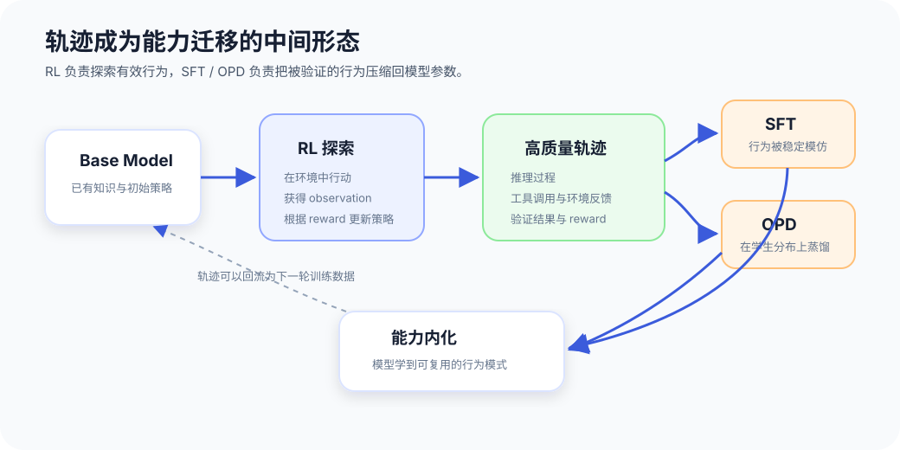
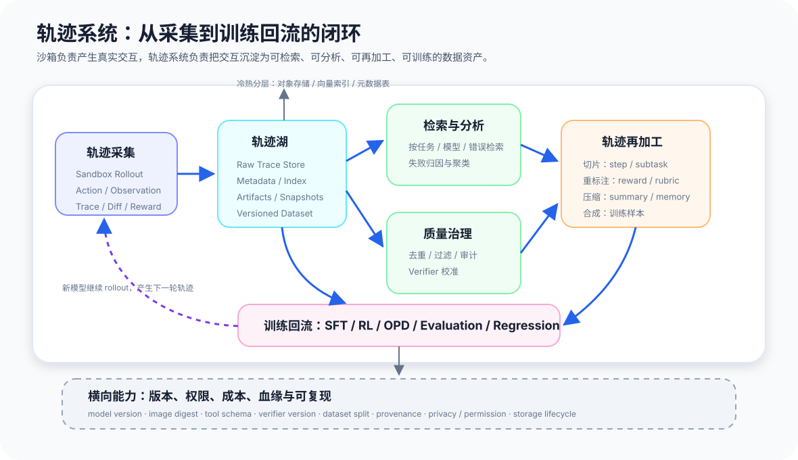
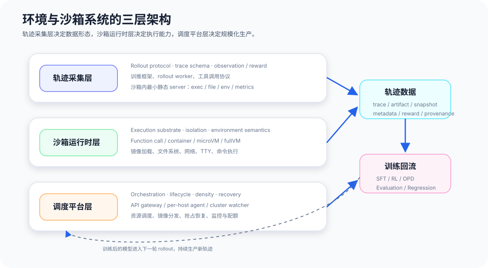
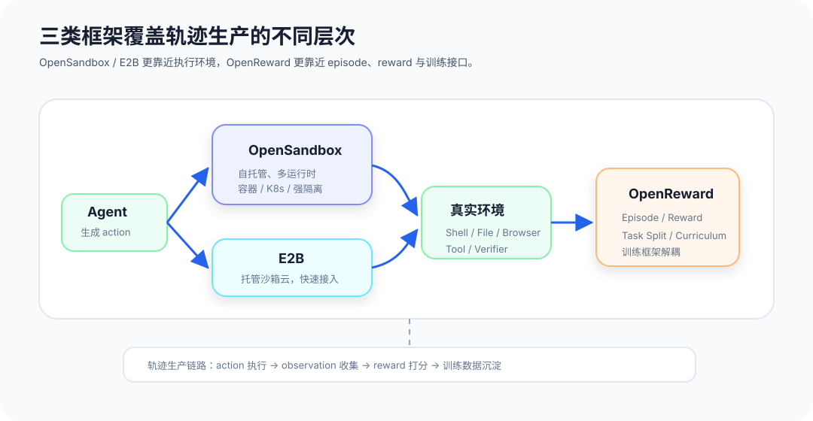
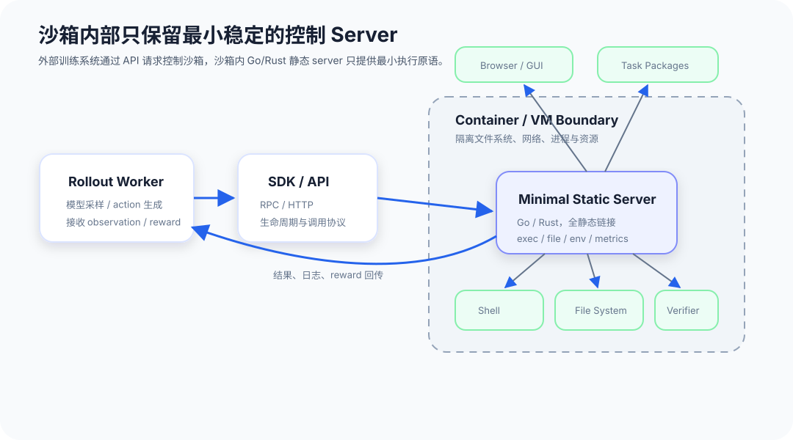

*本文为原创文章，版权归作者所有。未经许可，禁止转载。*

大模型训练最早给人的印象是“喂文本”。预训练阶段，模型从大规模语料中学习语言、知识和世界规律；SFT 阶段，模型从人工标注的指令数据中学习如何回答问题。这个视角在早期足够有效，因为模型要学的主要是输入到输出的映射：给定一段 prompt，生成一段符合人类偏好的 response。

但当模型开始具备推理、工具调用、代码修改、网页浏览和长程任务执行能力后，训练对象发生了变化。模型最终说了什么不再是最重要的问题。更值得关心的是它**如何一步一步到达结果**——查了哪些信息，调用了什么工具，执行了哪些命令，观察到什么反馈，在哪一步修正了计划，又是如何判断任务已经完成的。

这些过程合在一起，就是轨迹。

<!-- more -->

轨迹不是普通的日志。日志记录系统发生了什么，轨迹记录一个智能体如何行动、观察、决策和学习。对于今天的 Agent 模型来说，轨迹正在变成和语料同等重要，甚至更接近能力本身的数据形态。

## 从蒸馏到 RL：训练对象从答案走向过程

### 蒸馏：把强模型的行为压缩进弱模型

蒸馏的基本思想：让一个较小或较便宜的学生模型，学习一个更强教师模型的输出。早期蒸馏常常发生在 token 或 response 层面。教师模型给出答案，学生模型学习这个答案的分布，尽量在相同输入下复现教师的行为。

如果任务只是问答、总结、分类或简单代码生成，最终答案本身就包含了大量监督信号。模型只要学会在给定输入下输出类似答案，就能获得可见提升。

但对于复杂推理任务，最终答案往往太稀疏。一个数学题最后只有一个数字，一个代码任务最后只有一个 patch，一个搜索任务最后只有一段结论。只看最终结果，学生模型很难知道教师模型中间经历了什么：它是如何拆解问题的，哪些路径被排除了，哪些证据被采纳了，哪些工具调用真正推动了任务进展。

这也是为什么 reasoning trace、tool trace、execution trace 会变得重要。蒸馏不再只是蒸馏答案，而是在蒸馏一种行为模式：面对复杂任务时，模型如何分解、探索、验证和收敛。

### RL：让模型在环境反馈中学习策略

RL 进一步改变了训练问题。在 SFT 或蒸馏中，数据通常先被生产出来，模型再学习这些数据；而在 RL 中，模型要自己和环境交互，生成行动序列，再根据奖励信号更新策略。

这时，轨迹就不只是训练材料，而是训练过程本身。一次 rollout 可以被看成：

```text
state -> action -> observation -> action -> observation -> ... -> reward
```

在大模型场景中，这条链路可以具体化为：

```text
prompt
  -> model thought / plan
  -> tool call
  -> environment result
  -> updated context
  -> next action
  -> final answer
  -> verifier / reward
```

RL 的关键不是“奖励最终答案”，而是通过大量轨迹估计哪些行为更可能带来高质量结果。对于数学、代码、搜索、网页操作、软件工程任务来说，模型能力来自反复经历完整任务过程，而不是只背下正确答案。

这也解释了为什么 Agent 训练天然依赖环境。没有环境，模型只能生成看似合理的动作；有了环境，动作才会变成可执行事件，随后产生真实反馈。代码能不能编译、测试是否通过、网页按钮是否存在、搜索证据是否支持结论、文件修改是否破坏已有逻辑，这些都不是模型自己凭空判断出来的，而是环境返回给它的。

### 从 RL 轨迹回流到 SFT

RL 轨迹回流到 SFT 还有一层意义：RL 不只是一种直接优化模型策略的方法，也可以变成一种高质量轨迹生产机制。DeepSeek-V3 的技术报告中已经体现了这个思路：先通过 RL 让模型在任务中探索，产生带有推理过程、行动路径和验证结果的高质量轨迹；再把这些轨迹筛选、整理成 SFT 数据，回流给模型做监督微调。

SFT 因此不再完全依赖人类从零书写示范，也不只是学习强模型给出的最终答案。RL 在这里扮演了“搜索器”的角色：它在巨大的行为空间里探索哪些推理路径、工具使用方式和解题步骤真的有效；SFT 则把这些被验证过的行为压缩成更稳定、更便宜、更容易学习的数据分布。


```text
Base Model
  -> RL Exploration
  -> Successful / High-Reward Trajectories
  -> Filtering and Formatting
  -> SFT Dataset
  -> Model with Internalized Capability
```

{width=100%}

这条路径解释了为什么轨迹会成为能力迁移的中间形态。RL 负责在环境和奖励中发现能力，SFT 负责把能力固化到模型参数中。模型最后看起来像是“学会了某种推理能力”，但这背后并不是凭空出现的，而是大量可验证轨迹被反复生产、筛选和蒸馏的结果。

### OPD：在模型自己的分布上融合多个专家

OPD，也就是 On-Policy Distillation，是蒸馏和 RL 之间的一种连接。传统蒸馏常常让学生学习教师在固定数据上的输出，而 OPD 更强调在学生自己的生成轨迹上学习教师分布。也就是说，学生不是只看静态题库，而是在自己会走到的状态上，接受一个或多个教师模型的指导。

这个变化改变了训练问题的结构。对于复杂任务，学生模型和教师模型看到的状态分布可能并不一致。教师模型可能一步就走到高质量路径，而学生模型会走到更多中间状态、错误状态、犹豫状态和偏离状态。如果只在教师轨迹上蒸馏，学生一旦偏离教师路径，就可能不知道如何恢复。

OPD 的价值在于：让教师在学生真实会进入的状态上提供监督。它不只教学生“理想情况下应该怎么做”，也教学生“当你已经走到这里，下一步应该如何修正”。

从这个角度看，轨迹质量直接决定 OPD 的上限。轨迹必须覆盖足够多真实状态，包含足够丰富的任务分布，并保留能让教师、奖励模型或 verifier 判断质量的上下文。如果轨迹只有最终答案，OPD 能学到的只是表面行为；如果轨迹保留了完整的 action、observation、环境状态和验证结果，它就能成为模型策略改进的细粒度材料。

## 轨迹、环境与沙箱：从数据形态到生产边界

如果沿着前面的训练范式继续往下看，轨迹的重要性并不只在算法层面。它同时改变了数据、环境和基础设施的组织方式。数据不再只是静态样本，环境不再只是评测工具，沙箱也不再只是安全容器。三者组合起来，才构成了智能体能力生产的基本单元。

### 轨迹：从静态知识到动态行为

轨迹的重要性，可以从三个层面理解。

第一，轨迹把能力从静态知识变成动态行为。预训练语料告诉模型世界上有什么，指令数据告诉模型人类希望它怎么回答，而轨迹告诉模型在一个变化的环境中如何行动。Agent 能力本质上不是单次生成能力，而是跨多轮状态转移的决策能力。

第二，轨迹把结果和原因连接起来。一个任务成功或失败，往往不是由最后一句话决定的，而是由之前几十步选择共同决定的。没有轨迹，我们只能看到成功率；有了轨迹，才能分析失败发生在哪个环节：是计划错了，工具用错了，证据没读懂，测试没跑，还是环境状态被污染了。

第三，轨迹是可复用的训练资产。同一条高质量轨迹可以用于 SFT、偏好建模、RL reward 设计、OPD、错误分析、benchmark regression 和 harness 改进。它既是样本，也是证据；既服务模型训练，也服务系统迭代。

因此，大模型时代的数据工程会从“收集文本”走向“生产轨迹”。而一旦目标变成生产轨迹，环境和沙箱就会从边缘工具变成核心基础设施。

### 环境：让轨迹从生成文本变成真实反馈

轨迹不是模型单方面生成的。它一定发生在某个环境中。

对于代码 Agent，环境包括仓库、依赖、编译器、测试框架、文件系统、shell、网络和权限。对于浏览器 Agent，环境包括网页 DOM、账号状态、网络延迟、前端错误、弹窗和真实用户路径。对于数据分析 Agent，环境包括数据文件、Python 包、数据库连接、查询权限和可视化工具。

如果环境是假的，轨迹也会失真。模型可以声称自己运行了测试，但如果没有真实 shell，这只是文本；模型可以声称自己修好了 bug，但如果没有真实仓库和验证器，这只是猜测；模型可以声称搜索到了证据，但如果没有可追溯来源，这只是生成。

真实环境给轨迹提供三个东西：

- **可执行性**：动作真的发生，工具调用真的改变状态。
- **可验证性**：结果可以被测试、编译、比较、审计或人工复查。
- **反事实信息**：错误、异常、失败测试和权限拒绝会暴露模型原本看不到的边界。

很多时候，失败轨迹比成功轨迹更有价值。因为失败轨迹包含了模型能力的真实缺口：它不知道哪个命令会超时，不知道哪个 API 已废弃，不知道测试失败意味着什么，不知道环境状态已经被上一步破坏。没有这些环境反馈，训练只能强化“看起来合理”的回答，而不是强化“在真实世界里有效”的行动。

### 沙箱：让真实环境可以安全规模化

如果说环境决定轨迹是否真实，那么沙箱决定轨迹能否安全、稳定、低成本地规模化生产。

Agent 训练和评测需要大量并发执行。每个任务都可能启动一个仓库、安装依赖、运行测试、写文件、访问网络、调用工具，甚至执行模型生成的任意代码。直接在共享机器上运行这些动作是不现实的：安全风险太高，状态污染不可控，资源隔离困难，复现也几乎不可能。

沙箱的作用，是把每条轨迹放进一个受控边界里。这个边界至少要解决几个问题：

- **隔离**：一个任务不能破坏宿主机，也不能影响其他任务。
- **复现**：相同初始状态、相同输入和相同工具版本，应当尽量得到可解释的结果。
- **回收**：任务结束后，文件、进程、网络连接和临时状态可以被清理。
- **观测**：命令、文件变更、stdout、stderr、退出码、资源用量和时间线需要被记录。
- **恢复**：训练任务被抢占或机器故障后，已完成的部分不应全部丢失。

DeepSeek-V4 中提到的 DSec 是一个很典型的方向：它不是只提供一个 Docker 容器，而是把 Function Call、Container、microVM、fullVM 放到统一接口下面，根据任务需求选择不同隔离强度和执行成本。轻量函数调用可以走预热容器池，普通代码任务可以走 Docker-compatible container，安全敏感或高密度场景可以走 Firecracker microVM，需要任意操作系统时再走 QEMU fullVM。

这个设计背后的含义是：Agent 轨迹生产不是单一工作负载。不同任务对启动速度、隔离强度、镜像大小、系统调用、网络访问、文件持久化和可恢复性的要求完全不同。一个成熟的沙箱系统，必须把这些执行形态统一到同一套 command execution、file transfer 和 TTY access 接口之下，让上层训练框架不用关心底层到底是容器还是虚拟机。

## 如何基于沙箱生产轨迹

参考 DeepSeek-V4 技术报告中 DSec 的描述，环境和沙箱系统不应该只被理解成“运行代码的容器”。更准确地说，它是一套围绕轨迹生产建立的分层基础设施。上层负责 rollout 流程和数据采集，中层负责沙箱运行时本身，下层负责调度、分发、恢复和平台化管理。

更完整地看，轨迹系统是一条数据闭环：沙箱负责采集真实交互，轨迹湖负责保存原始过程和环境工件，检索与分析系统负责发现失败模式和高价值样本，再加工系统负责把原始轨迹切片、重标注、压缩和整理成训练数据，最后回流到 SFT、RL、OPD 和评测回归。

{width=100%}

从系统边界上看，可以把它拆成三层：

{width=100%}

这三层分别回答三个问题：轨迹如何被生产出来，动作在哪里执行，以及如何把大量沙箱作为一个平台稳定运行。这样的分层也能解释 OpenSandbox、E2B、OpenReward 这类框架的差异：有的更靠近运行时，有的更靠近托管平台，有的更靠近 episode、reward 和环境协议。

{width=100%}

### 轨迹采集层：Rollout 流程与数据形态

第一层是轨迹采集层，它回答“轨迹如何产生”。这一层主要由训推框架、rollout worker、工具调用协议、沙箱内 server、verifier 和 trace schema 决定。

一次 rollout 并不是简单地调用模型得到答案，而是一个持续交互过程：模型生成 action，沙箱执行 action，环境返回 observation，verifier 给出 reward 或中间判断，训练框架再把这些内容写入轨迹。最终沉淀下来的数据，也不应该只有 prompt 和 answer，而应该包括 action、observation、工具返回、文件 diff、stdout/stderr、退出码、资源消耗、环境状态摘要、reward、模型版本、采样参数和任务版本。

这一层最关键的是数据结构。如果 trace schema 设计得太粗，后续只能做最终成败统计；如果 trace schema 足够细，就可以支持失败归因、步骤级 reward、工具使用分析、轨迹切片、SFT 样本抽取和 OPD 训练。也就是说，轨迹采集层决定了这条轨迹未来能否被检索、分析和再加工。

在这个分层里，沙箱内 server 是非常关键的边界组件。它既参与 rollout 采集，又不能把太多控制面逻辑带进任务环境。

很多环境框架并不是让外部调度器直接操作沙箱里的进程和文件，而是在沙箱内部注入一个轻量 server。OpenSandbox 和 OpenReward 这类系统都可以放在这个模式下理解：外部 SDK、训练框架或 rollout worker 通过 RPC / HTTP 与沙箱内 server 通信，server 再在本地执行命令、读写文件、暴露工具接口、收集 observation，并把结果返回给外部。

这个 server 如果直接用 Python 编写，短期开发会很方便。Agent 环境里的工具链、评测脚本、数据处理、浏览器自动化、科学计算和 reward 逻辑大量依赖 Python 生态，把控制 server 放进沙箱内部，可以让环境逻辑更贴近真实执行上下文，也方便复用 Python 包、任务 harness 和 verifier。

但这个设计的代价也很明显：它对沙箱和容器的侵入性太高。原本沙箱应该尽量像一个干净、可替换、可复现的执行环境；一旦把 env worker 注入进去，基础镜像就必须携带额外 server、Python runtime、依赖包、端口协议和启动逻辑。环境不再只是任务环境，而变成了“任务环境 + 控制面代理”的混合体。

更麻烦的是，server 的升级和任务定义的升级都会牵动镜像升级。如果每次调整工具协议、reward 逻辑、verifier、任务 harness，都要重新构建并分发环境镜像，那么镜像存储和分发会很快变成系统瓶颈。轨迹生产需要大量并发沙箱，镜像层一旦频繁变动，缓存命中率下降，冷启动变慢，存储侧也会积累大量只差一点点的镜像版本。

一种自然的反方向，是把 server 放到沙箱外部，由宿主侧或 sidecar 负责命令执行、文件传输和资源观测。这样确实能降低对镜像的侵入，但它会失去一个关键优势：外部 server 并不天然处在沙箱的文件系统、环境变量、进程命名空间和权限上下文里。它要么需要 runtime 提供一套复杂的 exec / copy / inspect 接口，要么需要重新模拟沙箱内部状态。这样虽然控制面更干净，但环境语义反而容易变得不一致。

所以更合理的折中，是沙箱内部仍然保留一个 server，但这个 server 必须是**最小调用面**。它不应该承载任务逻辑、reward 逻辑或复杂 Python 依赖，而只提供稳定的原语：执行命令、读写文件、查询环境、流式返回 stdout/stderr、上报退出码和资源使用。任务定义、verifier 和 reward 可以作为显式挂载或外部配置进入沙箱，而不是和 server 一起烘进基础镜像。

这个最小 server 更适合用 Go 或 Rust 编写，并做成全静态链接的单文件二进制。这样它不依赖 Python runtime，不污染任务依赖，不容易和用户环境发生包版本冲突，也更容易在不同容器、microVM 和 fullVM 里复用。server 本身应该像一个稳定的系统组件，而不是跟着每个任务频繁变化的应用代码。

{width=100%}

从轨迹生产的角度看，沙箱内 server 是 action 和 environment 之间的转译层。这个转译层越小、越稳定，observation 越可信，轨迹越完整，任务也越容易被复现。

### 沙箱运行时层：性能、隔离与功能覆盖

第二层是沙箱运行时层，它回答“动作在哪里执行”。这一层决定沙箱的性能、隔离强度、功能覆盖和环境语义。

DeepSeek-V4 中提到的 DSec 把 Function Call、Container、microVM、fullVM 放到统一接口下面，正是在运行时层处理不同任务的差异。轻量函数调用需要低延迟和预热池，代码任务需要 Docker-compatible container，安全敏感或高密度场景需要 Firecracker microVM，需要任意 guest OS 时则需要 QEMU fullVM。

运行时层还承担镜像和文件系统问题。镜像要包含任务运行所需的依赖、工具链、数据文件和初始化脚本。为了支持大规模并发，镜像不能每次完整拉取和解压，而要通过分层存储、按需加载、copy-on-write 和本地缓存来降低冷启动成本。对于 microVM 和 fullVM，还要考虑块设备格式、快照恢复和虚拟化带来的 page cache 重复问题。

这一层的核心权衡是：越接近真实机器，功能越完整、隔离越强，但启动和运行成本越高；越接近函数调用，启动越快、密度越高，但环境语义越受限。一个成熟的沙箱系统必须把这些执行形态统一到同一套 command execution、file transfer 和 TTY access 接口之下，让上层 rollout 框架不用关心底层到底是容器还是虚拟机。

### 调度平台层：规模、恢复与平台化

第三层是调度平台层，它回答“如何大规模运行”。当轨迹生产从少量评测任务扩展到 RL、OPD 和大规模 benchmark rollout 时，瓶颈会从单个沙箱的执行能力，转移到平台对数十万并发实例的生命周期管理能力。

这一层通常需要 API gateway、per-host agent、cluster watcher 或类似组件。API gateway 面向训练框架提供统一入口；per-host agent 管理本机 sandbox 的启动、销毁、文件挂载、网络和资源限制；cluster watcher 负责健康检查、容量感知、失败恢复和全局调度。DeepSeek DSec 中的 Apiserver、Edge、Watcher 就是类似分工。

调度层还必须和训练任务的生命周期对齐。RL 和 OPD rollout 经常运行在可抢占资源上，GPU 训练任务也可能因为资源调度或硬件故障中断。如果沙箱和训练任务不能一起恢复，轨迹就会丢失或变得不可复现。因此平台需要记录命令轨迹、保存必要状态、支持 checkpoint-based resumption，并在恢复时避免重复执行非幂等操作。

这也是为什么 DeepSeek-V4 技术报告强调 trajectory logging 和 preemption-safe resumption。轨迹日志不只是 debug 工具，而是平台恢复、溯源和确定性回放的基础设施。对于大规模轨迹生产来说，调度层如果不能处理抢占、失败、镜像分发和资源密度，运行时再强也很难变成稳定的数据生产系统。

### 轨迹湖、检索分析与训练回流

三层沙箱系统生产出来的轨迹，还需要进入轨迹湖。完整轨迹应至少包含输入、动作、观察、环境状态摘要、文件 diff、工具输出、资源消耗、错误信息、最终答案和验证结果。更进一步，还可以记录每一步对应的模型版本、采样参数、系统 prompt、工具 schema、镜像版本和数据版本。只有这样，轨迹才真正可复现、可筛选、可归因。

轨迹湖之上的检索和分析系统，决定这些轨迹能否再次被使用。它需要支持按任务类型、模型版本、错误类型、工具调用、reward 分布、环境版本和 verifier 结果检索轨迹，也需要支持失败聚类、重复样本识别、异常环境过滤和高价值轨迹发现。

轨迹再加工则把原始交互转化为训练数据。成功轨迹可以被切成 SFT 样本，失败轨迹可以用于训练恢复策略或构造 hard negative，步骤级 observation 可以用于 reward model 或 verifier 校准，完整 session 可以用于 OPD，让教师在学生真实会进入的状态上提供监督。

这条链路可以抽象为：

```text
Task Spec
  -> Rollout and Trace Collection
  -> Sandbox Runtime
  -> Platform Scheduling and Recovery
  -> Trajectory Lake
  -> Retrieval / Analysis / Reprocessing
  -> SFT / RL / OPD / Evaluation
```

这条链路里，沙箱不是执行细节，而是数据生产机器。它生产的不是单次工具结果，而是可训练、可审计、可重放的行为样本。真正困难的是把这台机器做成系统：上层轨迹采集要稳定，中层运行时要高性能且隔离可靠，下层调度平台要能承受大规模并发和频繁抢占。

## 结语：训练智能体，就是生产高质量轨迹

从蒸馏到 RL，再到 OPD，大模型训练越来越依赖过程数据。答案仍然重要，但答案已经不够。真正能提升 Agent 能力的，是模型在环境中行动、观察、修正和验证的完整过程。

这也是环境和沙箱系统的重要性所在。环境让轨迹真实，沙箱让轨迹可控，日志和快照让轨迹可复现，调度和分层镜像让轨迹可以规模化生产。最终，模型能力的迭代不再只是参数、数据和算法的问题，也变成了一个基础设施问题。

未来的 Agent 训练平台，很可能会围绕轨迹生产来设计：上层是模型、教师、奖励和 OPD；中间是任务、工具、verifier 和 harness；底层则是环境、沙箱、存储、调度和日志。谁能更稳定地生产高质量轨迹，谁就能更快地把真实世界反馈转化为模型能力。
